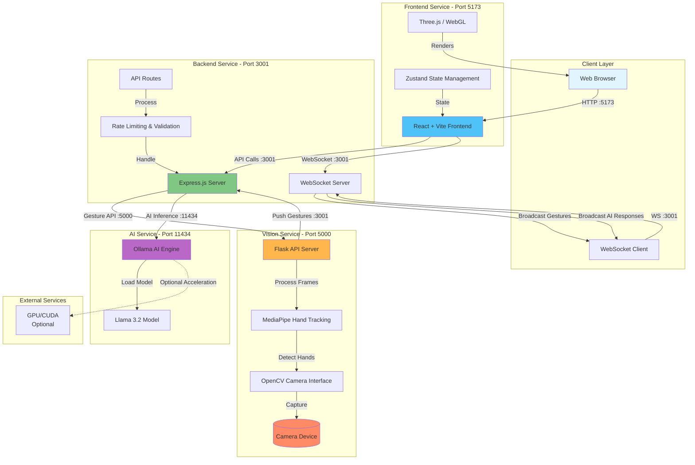
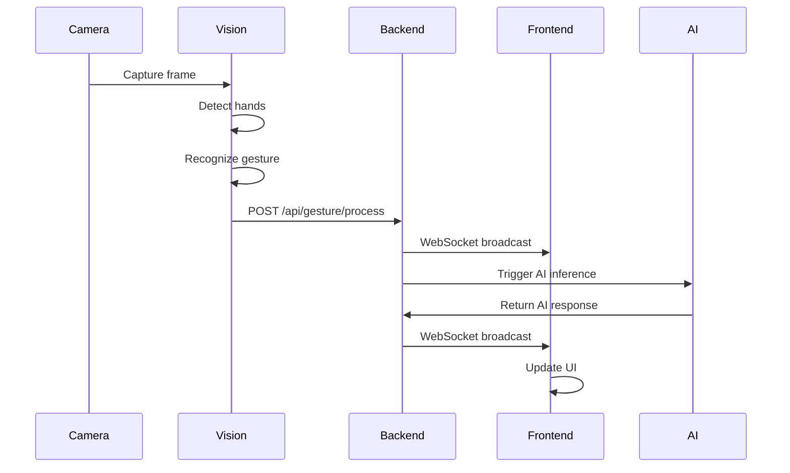
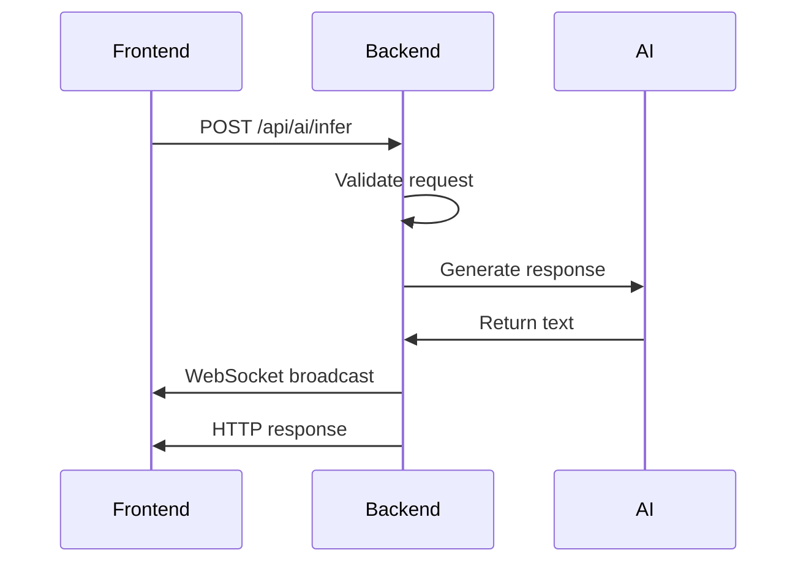
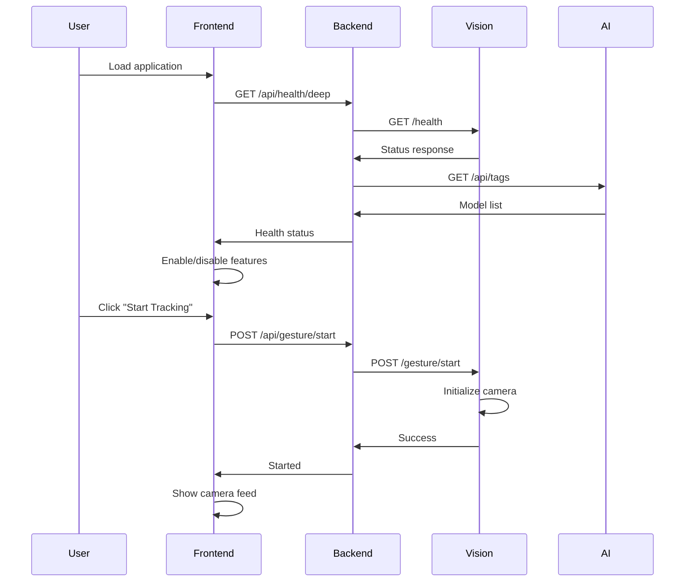
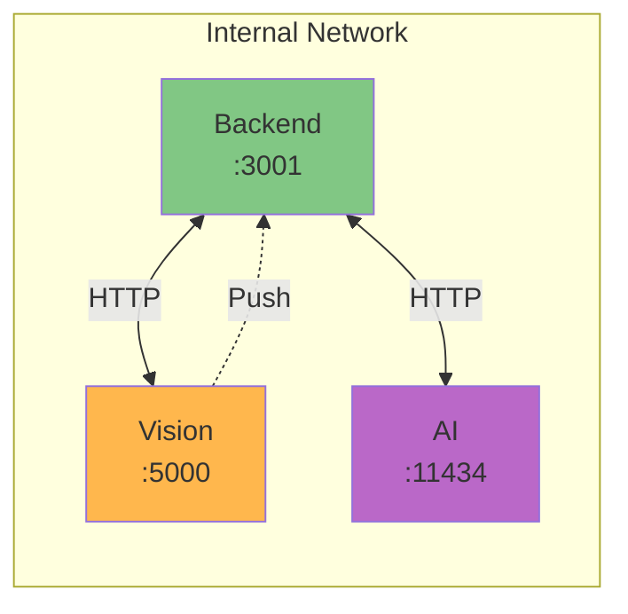
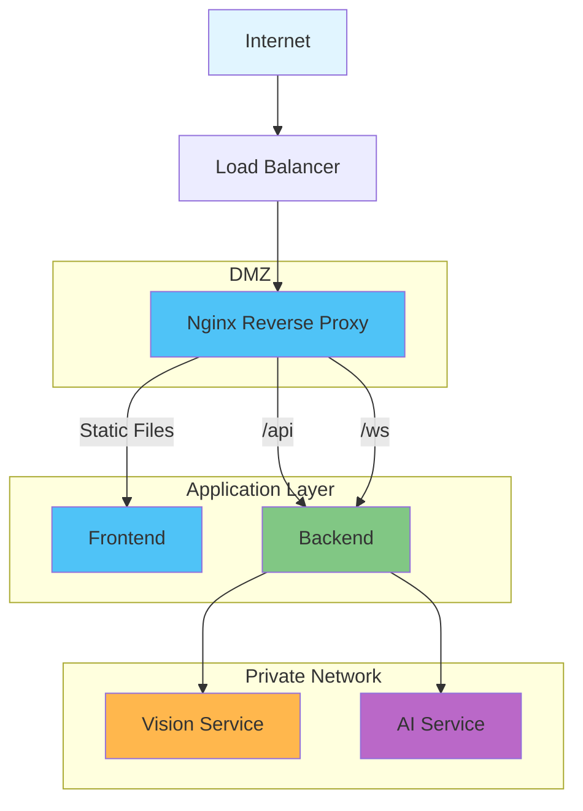
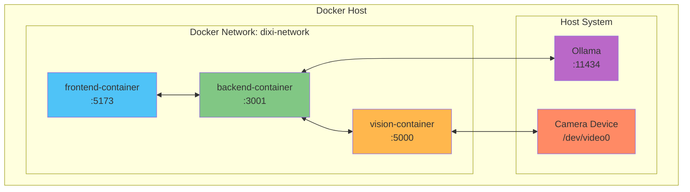
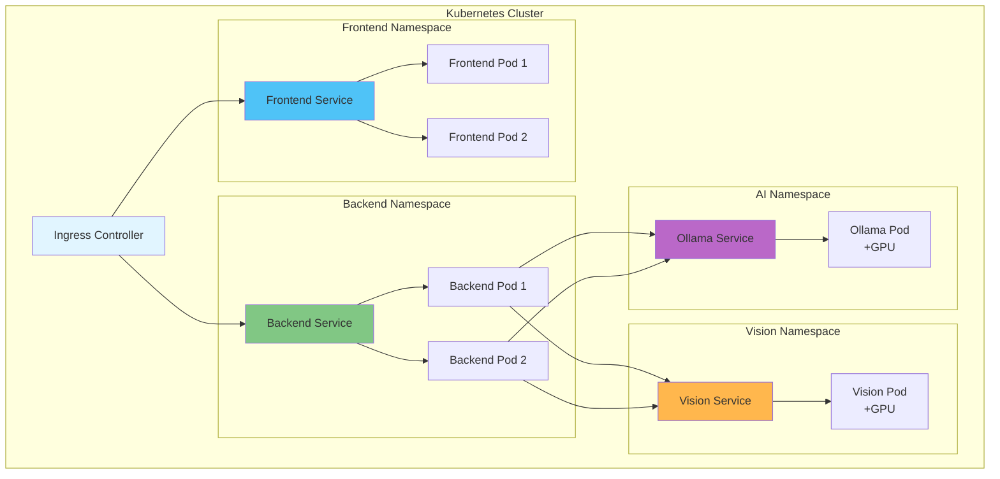
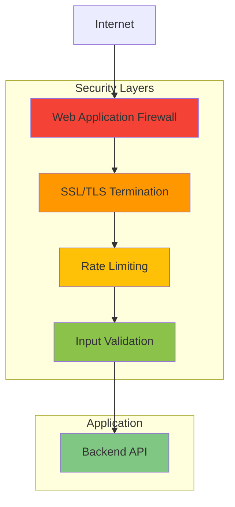

# System Overview

Complete system architecture showing all services, data flow, and port assignments.

## High-Level Architecture

## Service Details

### Frontend Service (Port 5173)
- **Technology**: React 18 + TypeScript + Vite
- **Purpose**: User interface and 3D projection rendering
- **Key Components**:
  - React components for UI
  - Three.js for WebGL rendering
  - Zustand for state management
  - WebSocket client for real-time updates
- **Dependencies**: Backend API, WebSocket server

### Backend Service (Port 3001)
- **Technology**: Node.js 20 + Express + TypeScript
- **Purpose**: Central coordination hub, API gateway, WebSocket server
- **Key Features**:
  - RESTful API endpoints
  - WebSocket server for real-time communication
  - Rate limiting middleware
  - Request validation
  - Gesture processing coordination
  - AI query orchestration
- **Dependencies**: Vision service, Ollama AI service

### Vision Service (Port 5000)
- **Technology**: Python 3.10 + Flask + MediaPipe + OpenCV
- **Purpose**: Computer vision and gesture recognition
- **Key Features**:
  - Camera interface and frame capture
  - Hand landmark detection (MediaPipe)
  - Gesture recognition (30+ gesture types)
  - Push architecture (sends gestures to backend)
- **Dependencies**: Camera device, Backend API

### AI Service (Port 11434)
- **Technology**: Ollama + Llama 3.2
- **Purpose**: Natural language processing and AI inference
- **Key Features**:
  - Text generation
  - Conversational AI
  - Context-aware responses
  - Streaming support
- **Dependencies**: Optional GPU/CUDA for acceleration

## Data Flow

### 1. Gesture Detection Flow

### 2. AI Query Flow

### 3. Initialization Flow

## Port Assignment Reference

| Service | Port | Protocol | Purpose |
|---------|------|----------|---------|
| Frontend Dev Server | 5173 | HTTP | Vite development server |
| Frontend Production | 80/443 | HTTP/HTTPS | Production build (nginx) |
| Backend API | 3001 | HTTP | REST API endpoints |
| Backend WebSocket | 3001 | WS/WSS | Real-time bidirectional communication |
| Vision Service | 5000 | HTTP | Computer vision API |
| Ollama AI | 11434 | HTTP | AI inference API |

## Network Communication

### Internal Service Communication

### External Access

## Deployment Topology

### Docker Compose Deployment

### Kubernetes Deployment

## Technology Stack Summary

### Frontend Stack
- **Runtime**: Browser (Chrome, Firefox, Safari, Edge)
- **Framework**: React 18.3
- **Build Tool**: Vite 5
- **Language**: TypeScript 5
- **State Management**: Zustand
- **3D Graphics**: Three.js + React Three Fiber
- **WebSocket**: Native WebSocket API
- **HTTP Client**: Fetch API

### Backend Stack
- **Runtime**: Node.js 20 LTS
- **Framework**: Express 4.18
- **Language**: TypeScript 5
- **WebSocket**: ws library
- **HTTP Client**: Axios
- **Validation**: Custom middleware
- **Rate Limiting**: Custom middleware

### Vision Stack
- **Runtime**: Python 3.10+
- **Framework**: Flask 3.0
- **Computer Vision**: OpenCV 4.8
- **Hand Tracking**: MediaPipe 0.10
- **Image Processing**: NumPy
- **HTTP Client**: Requests

### AI Stack
- **Engine**: Ollama
- **Model**: Llama 3.2 (3B/7B/13B variants)
- **Acceleration**: CUDA (optional)
- **API**: REST + streaming

## Performance Characteristics

### Latency Targets

| Operation | Target | Typical |
|-----------|--------|---------|
| Gesture detection | < 50ms | 30-40ms |
| Gesture → Backend | < 20ms | 10-15ms |
| Backend → Frontend (WS) | < 10ms | 5-8ms |
| AI inference (3B model) | < 500ms | 300-400ms |
| AI inference (7B model) | < 1500ms | 1000-1200ms |
| End-to-end (gesture → AI → UI) | < 2000ms | 1500ms |

### Throughput Targets

| Metric | Target |
|--------|--------|
| Gestures per second | 30 FPS |
| Concurrent WebSocket clients | 100+ |
| API requests per second | 200+ |
| AI queries per minute | 60+ |

## Security Considerations

### Security Measures
1. **Rate Limiting**: Prevents API abuse
2. **Input Validation**: Protects against injection attacks
3. **CORS Configuration**: Restricts cross-origin requests
4. **Helmet Security Headers**: Enhances HTTP security
5. **WebSocket Authentication**: (Planned) Secure WS connections
6. **API Key Authentication**: (Planned) Endpoint protection

---

*Last updated: 2025-12-21*
