# Backend Internal Architecture

Detailed architecture of the Node.js/Express backend service.

## Component Overview

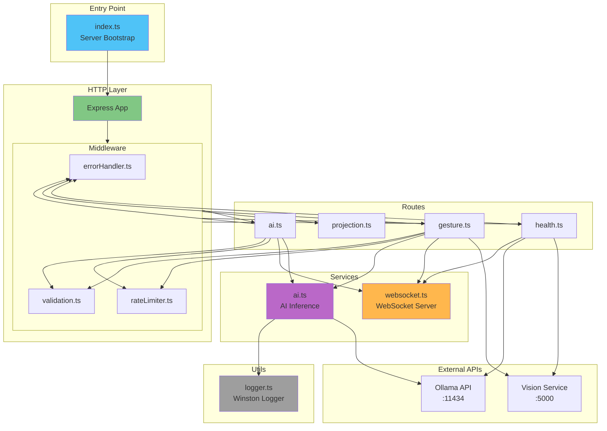

## Directory Structure

```
packages/backend/
├── src/
│   ├── index.ts                 # Application entry point
│   ├── routes/
│   │   ├── health.ts            # Health check endpoints
│   │   ├── gesture.ts           # Gesture processing endpoints
│   │   ├── ai.ts                # AI inference endpoints
│   │   └── projection.ts        # Projection management
│   ├── services/
│   │   ├── ai.ts                # AI service (Ollama client)
│   │   └── websocket.ts         # WebSocket server
│   ├── middleware/
│   │   ├── errorHandler.ts      # Global error handler
│   │   ├── rateLimiter.ts       # Rate limiting middleware
│   │   └── validation.ts        # Request validation
│   ├── utils/
│   │   └── logger.ts            # Winston logger configuration
│   └── __tests__/               # Test files
│       ├── health.test.ts
│       └── gesture.test.ts
├── package.json
└── tsconfig.json
```

## Core Components

### 1. Application Bootstrap (index.ts)

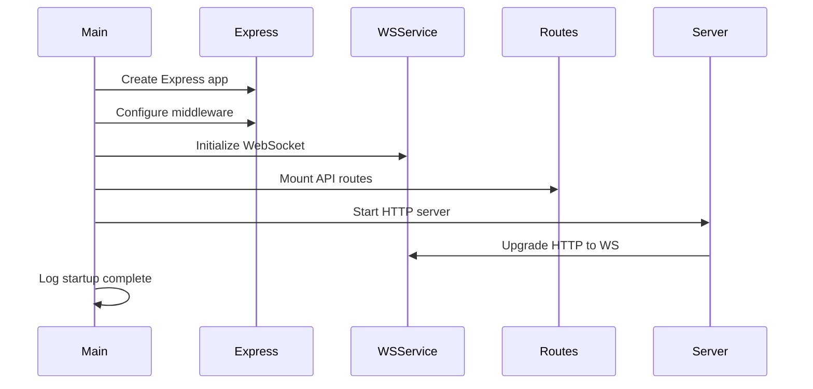

**Responsibilities:**
- Initialize Express application
- Configure middleware stack
- Initialize WebSocket server
- Mount API routes
- Start HTTP server
- Handle graceful shutdown

**Key Code Flow:**
1. Load environment variables
2. Create Express app
3. Configure CORS, body parsing, helmet
4. Initialize WebSocket service
5. Mount routes under `/api`
6. Start server on port 3001
7. Export wsService for other modules

---

### 2. Middleware Stack

```mermaid
graph LR
    Request[Incoming Request]
    CORS[CORS Handler]
    Helmet[Helmet Security]
    BodyParser[JSON Body Parser]
    Logger[Request Logger]
    RateLimit[Rate Limiter]
    Validation[Input Validation]
    Route[Route Handler]
    ErrorHandler[Error Handler]
    Response[Response]

    Request --> CORS
    CORS --> Helmet
    Helmet --> BodyParser
    BodyParser --> Logger
    Logger --> RateLimit
    RateLimit --> Validation
    Validation --> Route
    Route --> ErrorHandler
    ErrorHandler --> Response

    style Request fill:#e1f5ff
    style Route fill:#81c784
    style ErrorHandler fill:#f44336
    style Response fill:#4caf50
```

#### Middleware Execution Order

1. **CORS** - Cross-Origin Resource Sharing
   - Allows frontend to access backend
   - Configured for development and production

2. **Helmet** - Security headers
   - Sets various HTTP headers for security
   - Protects against common vulnerabilities

3. **Body Parser** - JSON request parsing
   - Parses JSON request bodies
   - Limits body size (10mb default)

4. **Logger** - Request logging
   - Logs all incoming requests
   - Includes method, path, status, duration

5. **Rate Limiter** - Request throttling
   - Different limits per endpoint type
   - IP-based tracking
   - Configurable windows and limits

6. **Validation** - Input validation
   - Validates request parameters
   - Sanitizes input data
   - Returns 400 for invalid requests

7. **Error Handler** - Global error handling
   - Catches all errors
   - Formats error responses
   - Logs errors with context

---

### 3. Route Handlers

#### Health Route (health.ts)

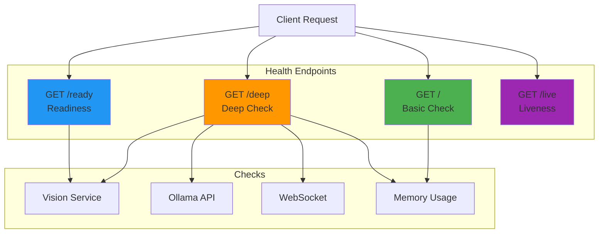

**Endpoints:**
- `GET /api/health` - Fast health check
- `GET /api/health/deep` - Comprehensive health check
- `GET /api/health/ready` - Kubernetes readiness probe
- `GET /api/health/live` - Kubernetes liveness probe

---

#### Gesture Route (gesture.ts)

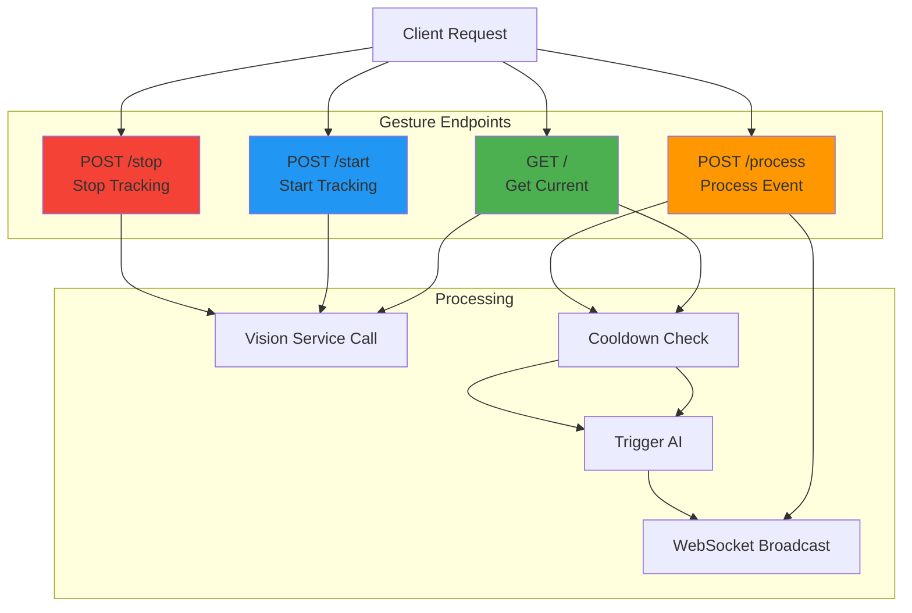

**Key Features:**
- **Gesture Cooldown**: Prevents duplicate AI triggers (2-second cooldown per gesture type)
- **Automatic AI Triggering**: Gestures automatically trigger AI inference
- **WebSocket Broadcasting**: Gestures broadcast to all connected clients
- **Vision Service Integration**: Proxies requests to vision service

**Gesture Types Supported:**
- wave, point, pinch
- swipe_left, swipe_right, swipe_up, swipe_down
- fist, open_palm
- thumbs_up, thumbs_down
- peace, ok
- unknown

---

#### AI Route (ai.ts)

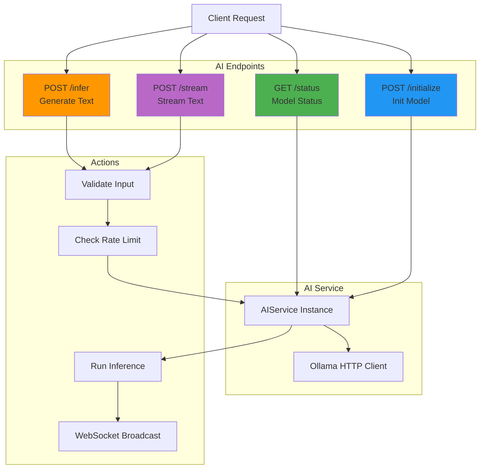

**Key Features:**
- **Rate Limiting**: 50 requests per 15 minutes
- **Input Validation**: Query max 5000 chars, context max 2000 chars
- **WebSocket Broadcasting**: AI responses broadcast to all clients
- **Streaming Support**: Server-Sent Events for long responses
- **Error Handling**: Graceful fallback when AI unavailable

---

### 4. Services

#### AI Service (ai.ts)

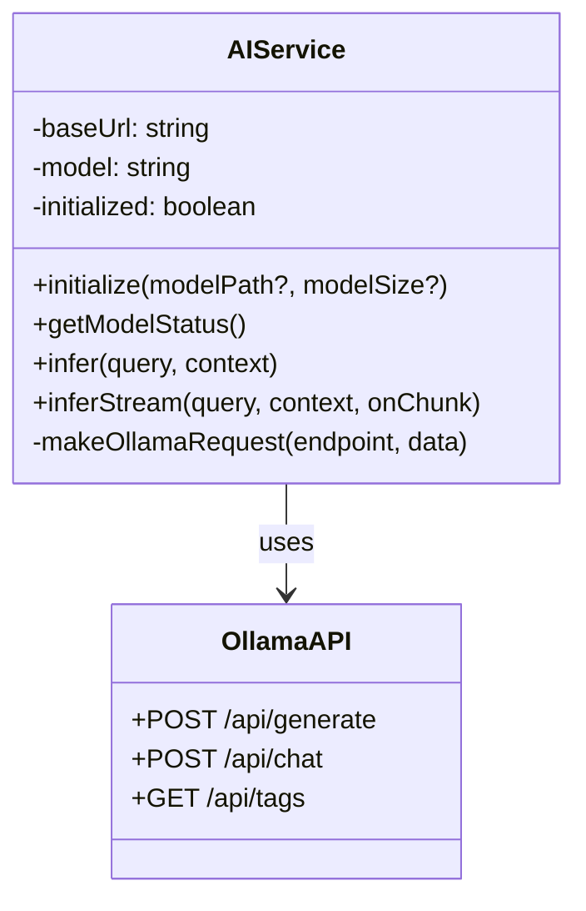

**Responsibilities:**
- Manage Ollama API connection
- Initialize and check AI models
- Generate text responses
- Stream responses for long outputs
- Handle AI errors gracefully

**Methods:**
- `initialize()` - Check Ollama availability and load model
- `getModelStatus()` - Get current model information
- `infer()` - Generate text response
- `inferStream()` - Stream text response with callbacks

---

#### WebSocket Service (websocket.ts)

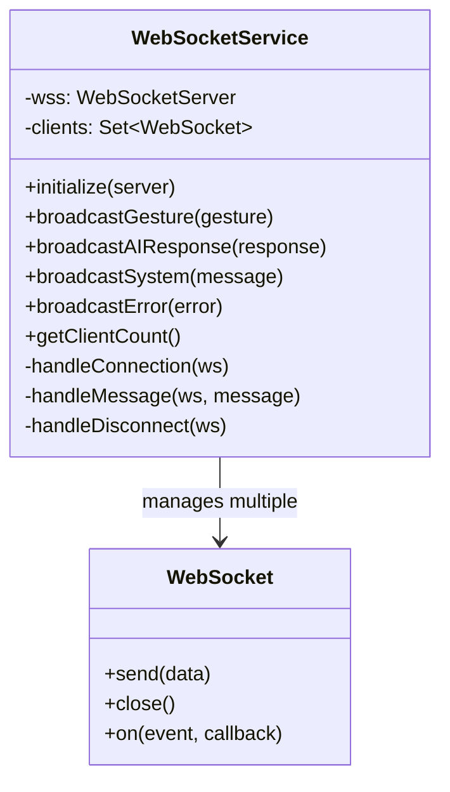

**Responsibilities:**
- Manage WebSocket server lifecycle
- Handle client connections/disconnections
- Broadcast messages to all clients
- Handle incoming messages from clients
- Track connected client count

**Message Types:**
- `gesture` - Gesture detection updates
- `ai_response` - AI inference results
- `system` - System events and status
- `error` - Error notifications

**Broadcast Methods:**
- `broadcastGesture()` - Send gesture updates
- `broadcastAIResponse()` - Send AI responses
- `broadcastSystem()` - Send system messages
- `broadcastError()` - Send error notifications

---

### 5. Middleware Details

#### Rate Limiter (rateLimiter.ts)

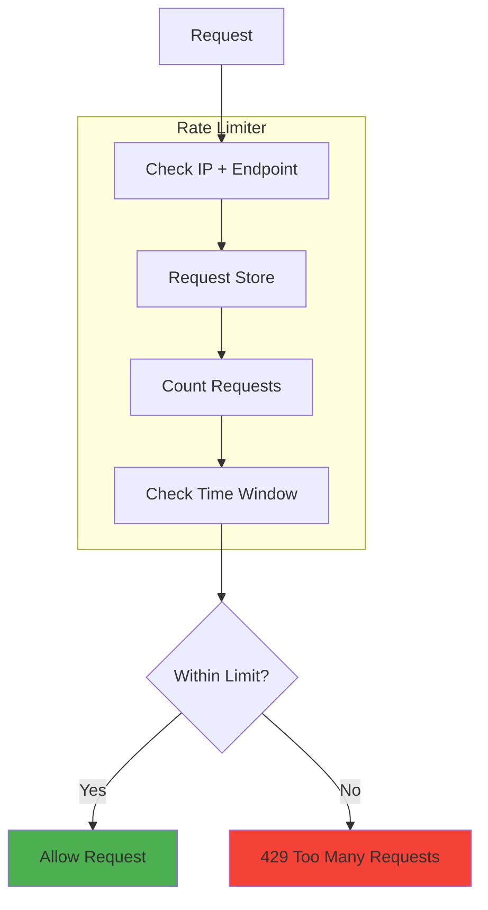

**Configuration:**
- **Gesture Limiter**: 100 requests / 15 minutes
- **AI Limiter**: 50 requests / 15 minutes
- **Default Limiter**: 200 requests / 15 minutes

**Headers Added:**
```
X-RateLimit-Limit: 100
X-RateLimit-Remaining: 99
X-RateLimit-Reset: 1640000000
```

---

#### Validation Middleware (validation.ts)

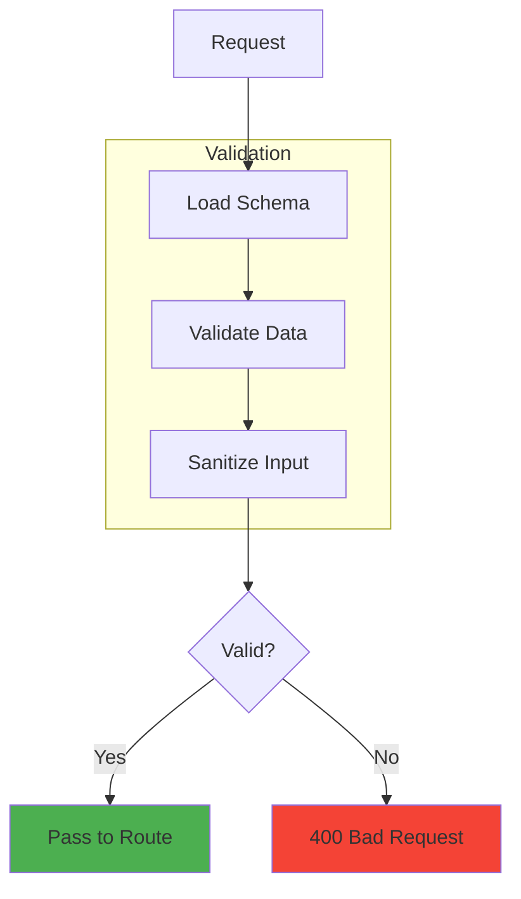

**Validators:**
- `validateGestureProcess` - Validates gesture data
  - Required: type, confidence
  - Optional: position, timestamp
  - Confidence: 0-1 range

- `validateAIInfer` - Validates AI requests
  - Required: query (max 5000 chars)
  - Optional: context (max 2000 chars)

- `validateAIInit` - Validates AI initialization
  - Optional: modelPath, modelSize

---

#### Error Handler (errorHandler.ts)

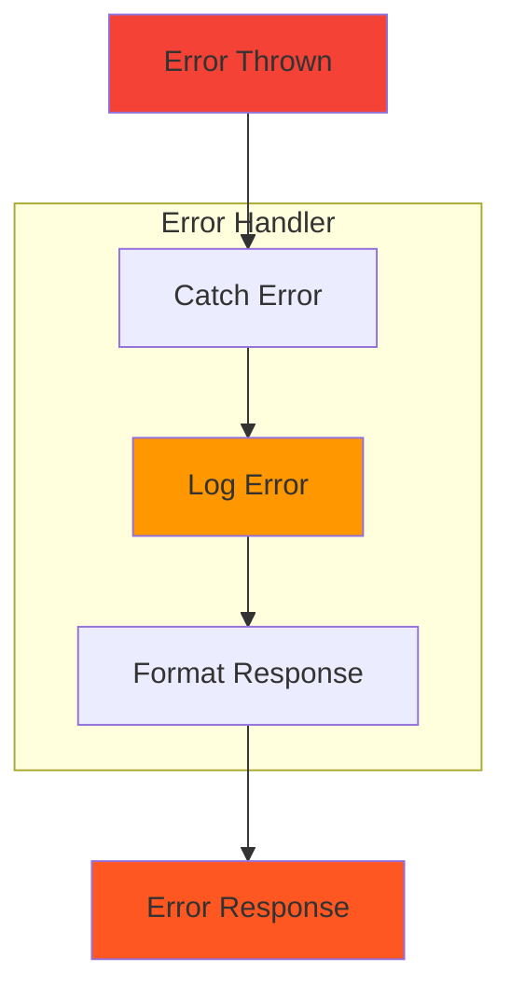

**Error Response Format:**
```json
{
  "error": "Short description",
  "details": "Detailed message",
  "timestamp": "2025-12-21T21:00:00.000Z",
  "path": "/api/gesture",
  "status": 500
}
```

**Error Types Handled:**
- Validation errors (400)
- Rate limit errors (429)
- Internal server errors (500)
- Service unavailable (503)
- Not found (404)

---

### 6. Logger (logger.ts)

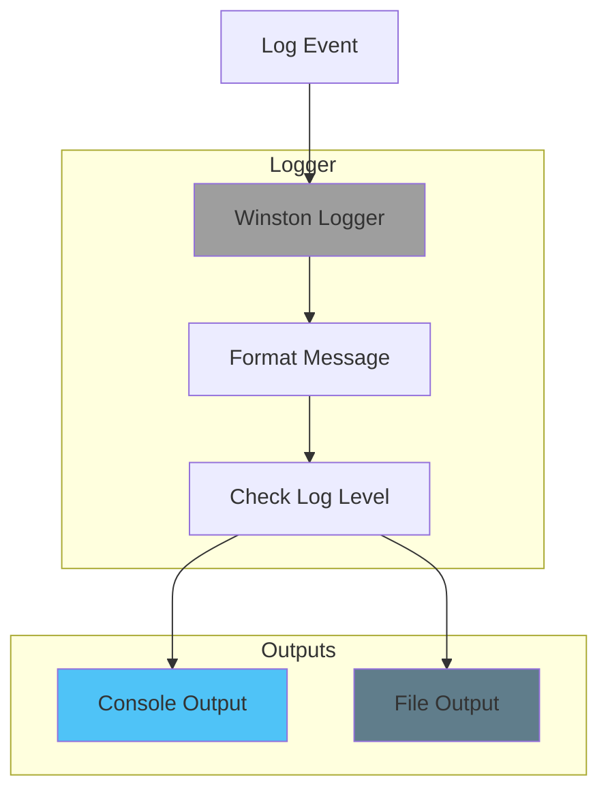

**Log Levels:**
- `error` - Error conditions
- `warn` - Warning conditions
- `info` - Informational messages
- `debug` - Debug messages

**Log Format:**
```
[2025-12-21 21:00:00] INFO: Server started on port 3001
[2025-12-21 21:00:01] DEBUG: Gesture detected: wave
[2025-12-21 21:00:02] ERROR: AI service unavailable
```

---

## Request Flow Examples

### Example 1: Gesture Detection

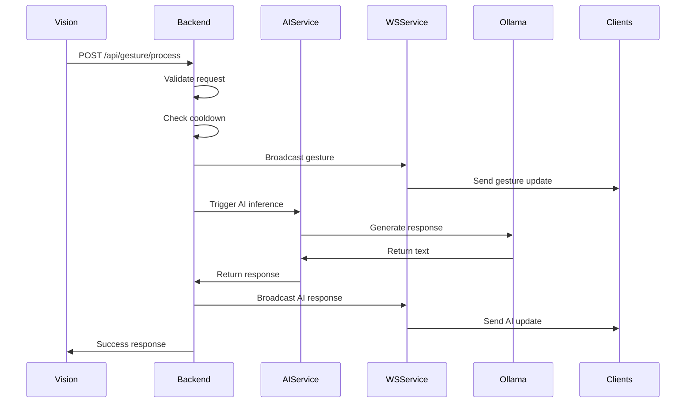

### Example 2: AI Query

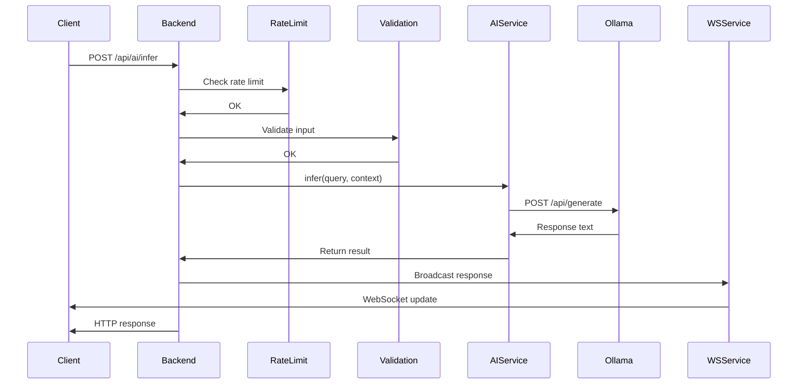

---

## Configuration

### Environment Variables

```bash
# Server
NODE_ENV=production
PORT=3001

# CORS
FRONTEND_URL=http://localhost:5173

# Services
VISION_SERVICE_URL=http://localhost:5000
OLLAMA_BASE_URL=http://localhost:11434

# AI
MODEL_SIZE=7B
MODEL_PATH=llama3.2:latest

# Logging
LOG_LEVEL=info

# Rate Limiting
GESTURE_RATE_LIMIT=100
AI_RATE_LIMIT=50
RATE_LIMIT_WINDOW_MS=900000
```

---

## Performance Optimization

### 1. Caching Strategy (Future)
- Cache AI responses by query hash
- Cache gesture analysis results
- TTL-based expiration

### 2. Request Batching (Future)
- Batch multiple gesture events
- Reduce WebSocket messages
- Aggregate updates

### 3. Connection Pooling
- Reuse HTTP connections to Vision service
- Reuse connections to Ollama
- Configure keep-alive

---

## Testing Strategy

### Unit Tests
- Test individual route handlers
- Test service methods
- Test middleware functions

### Integration Tests
- Test full request flows
- Test service interactions
- Test error scenarios

### Load Tests
- Test WebSocket scalability
- Test concurrent gesture processing
- Test AI inference queue

---

*Last updated: 2025-12-21*
