# Frontend Component Architecture

Detailed architecture of the React frontend application.

## Component Overview

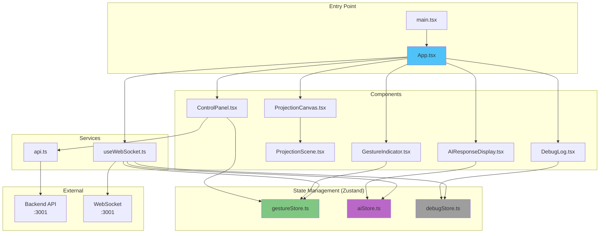

## Directory Structure

```
packages/frontend/
├── src/
│   ├── main.tsx                    # Application entry
│   ├── App.tsx                     # Root component
│   ├── components/
│   │   ├── ControlPanel.tsx        # Control buttons
│   │   ├── GestureIndicator.tsx    # Gesture visualization
│   │   ├── ProjectionCanvas.tsx    # 3D canvas container
│   │   ├── ProjectionScene.tsx     # Three.js scene
│   │   ├── AIResponseDisplay.tsx   # AI response UI
│   │   └── DebugLog.tsx           # Debug console
│   ├── hooks/
│   │   └── useWebSocket.ts        # WebSocket hook
│   ├── services/
│   │   └── api.ts                 # API client
│   ├── store/
│   │   ├── gestureStore.ts        # Gesture state
│   │   ├── aiStore.ts             # AI state
│   │   └── debugStore.ts          # Debug state
│   └── styles/
│       └── index.css              # Global styles
├── public/
│   └── index.html
├── package.json
├── vite.config.ts
└── tsconfig.json
```

## Core Components

### 1. App Component (App.tsx)

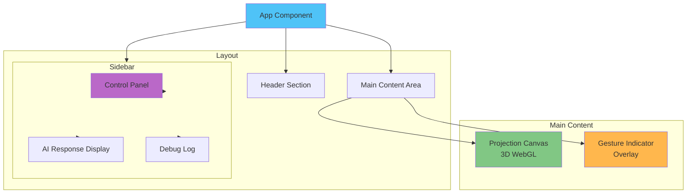

**Responsibilities:**
- Root layout and structure
- Initialize WebSocket connection
- Coordinate global state
- Handle app-level lifecycle

**Key Features:**
- Responsive grid layout
- Dark theme by default
- WebSocket connection management
- Error boundary (future)

---

### 2. Control Panel Component

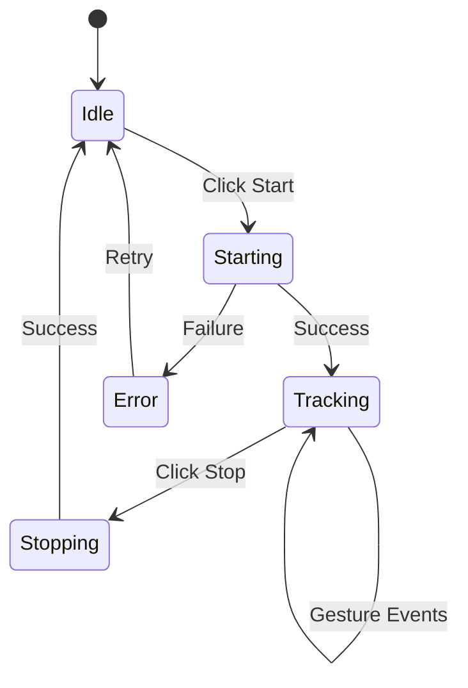

**UI Elements:**
- **Start Tracking Button** - Initiates gesture detection
- **Stop Tracking Button** - Stops gesture detection
- **Status Indicator** - Shows tracking state
- **Health Check Display** - Service status
- **Settings Panel** (future) - Configuration options

**State Management:**
```typescript
interface ControlPanelState {
  isTracking: boolean;
  isLoading: boolean;
  error: string | null;
  health: HealthStatus | null;
}
```

**Interactions:**
- Calls `/api/gesture/start` to begin
- Calls `/api/gesture/stop` to end
- Displays real-time status from WebSocket
- Shows error messages on failures

---

### 3. Gesture Indicator Component

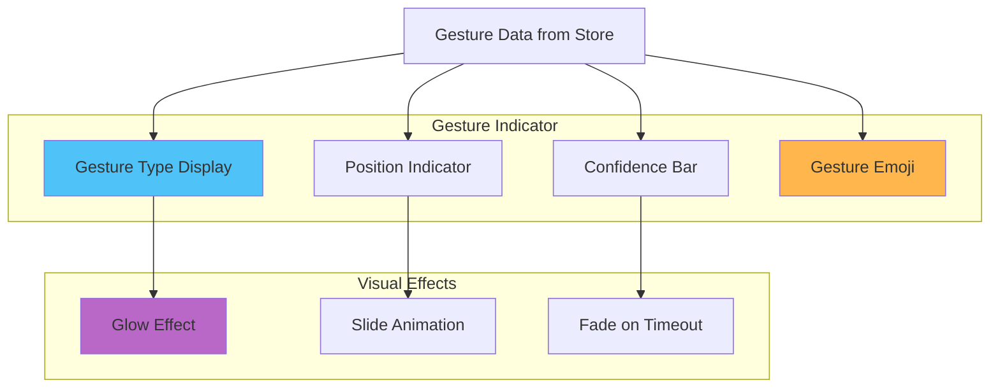

**Display Elements:**
- **Gesture Type** - Name of detected gesture
- **Emoji Icon** - Visual representation
- **Confidence Level** - Percentage and progress bar
- **Position Marker** - X/Y coordinates on canvas
- **Timestamp** - Time of detection

**Gesture Type Mapping:**
```typescript
const GESTURE_EMOJIS = {
  wave: '👋',
  point: '👉',
  pinch: '🤏',
  swipe_left: '⬅️',
  swipe_right: '➡️',
  swipe_up: '⬆️',
  swipe_down: '⬇️',
  fist: '✊',
  open_palm: '✋',
  thumbs_up: '👍',
  thumbs_down: '👎',
  peace: '✌️',
  ok: '👌',
  unknown: '❓'
};
```

**Animation Behavior:**
- Slide in from right on new gesture
- Pulse effect on high confidence (>0.9)
- Fade out after 3 seconds
- Position marker follows hand location

---

### 4. Projection Canvas Component

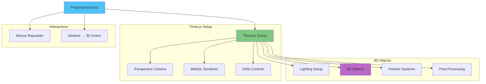

**React Three Fiber Integration:**
```tsx
<Canvas>
  <PerspectiveCamera position={[0, 0, 5]} />
  <OrbitControls />
  <ambientLight intensity={0.5} />
  <pointLight position={[10, 10, 10]} />
  <ProjectionScene />
</Canvas>
```

**Gesture → 3D Mappings:**
- **Wave** - Spawn particle burst
- **Point** - Raycast and select object
- **Pinch** - Grab and move object
- **Swipe** - Rotate camera
- **Fist** - Delete selected object
- **Open Palm** - Create new object

---

### 5. Projection Scene Component

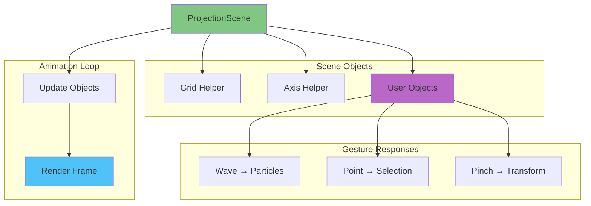

**3D Objects:**
- Interactive cubes, spheres, and custom meshes
- Particle effects for gesture feedback
- Grid and axis helpers for spatial reference

**Animation Features:**
- Smooth transitions with `react-spring`
- Physics-based movements (future)
- Gesture-driven animations

---

### 6. AI Response Display Component

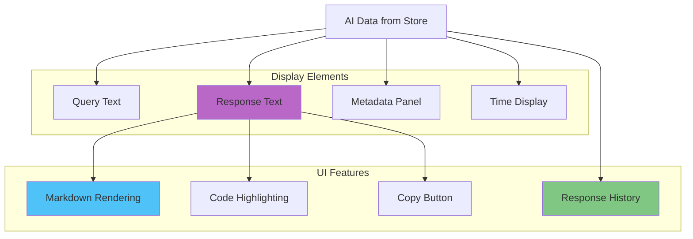

**Display Format:**
```
┌─────────────────────────────────┐
│ 🤖 AI Response                  │
├─────────────────────────────────┤
│ Query: "What is gesture...?"    │
│                                 │
│ Response text here with         │
│ markdown support...             │
│                                 │
│ Model: llama3.2:latest          │
│ Time: 1.2s | Tokens: 45         │
└─────────────────────────────────┘
```

**Features:**
- Markdown rendering for formatted text
- Code syntax highlighting
- Copy to clipboard button
- Scrollable response history
- Metadata display (model, time, tokens)

---

### 7. Debug Log Component

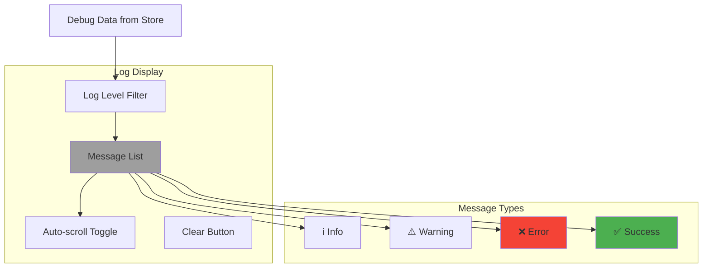

**Log Entry Format:**
```
[21:00:00] ℹ️ WebSocket connected
[21:00:01] ✅ Gesture tracking started
[21:00:02] 👋 Wave gesture detected (92%)
[21:00:03] ⚠️ AI service slow response
[21:00:04] ❌ Camera unavailable
```

**Features:**
- Color-coded by log level
- Timestamps for each entry
- Filterable by log level
- Auto-scroll to latest entry
- Clear log button
- Export logs (future)

---

## State Management (Zustand)

### Gesture Store

```typescript
interface GestureState {
  currentGesture: Gesture | null;
  gestureHistory: Gesture[];
  isTracking: boolean;
  setCurrentGesture: (gesture: Gesture) => void;
  addToHistory: (gesture: Gesture) => void;
  setTracking: (tracking: boolean) => void;
  clearHistory: () => void;
}
```

**Store Structure:**
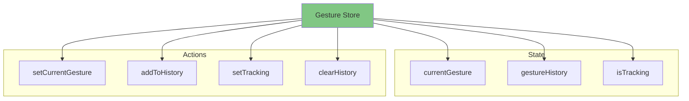

---

### AI Store

```typescript
interface AIState {
  currentResponse: AIResponse | null;
  responseHistory: AIResponse[];
  isGenerating: boolean;
  setCurrentResponse: (response: AIResponse) => void;
  addToHistory: (response: AIResponse) => void;
  setGenerating: (generating: boolean) => void;
  clearHistory: () => void;
}
```

**Store Structure:**
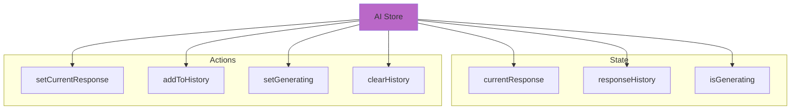

---

### Debug Store

```typescript
interface DebugState {
  logs: LogEntry[];
  logLevel: 'debug' | 'info' | 'warn' | 'error';
  addLog: (log: LogEntry) => void;
  setLogLevel: (level: string) => void;
  clearLogs: () => void;
}
```

---

## Services & Hooks

### API Service (api.ts)

```typescript
class APIService {
  private baseUrl: string;

  async startGestureTracking(): Promise<void>;
  async stopGestureTracking(): Promise<void>;
  async getGesture(): Promise<Gesture>;
  async sendAIQuery(query: string, context?: string): Promise<AIResponse>;
  async getHealth(): Promise<HealthStatus>;
}
```

**Methods:**
- `startGestureTracking()` - POST /api/gesture/start
- `stopGestureTracking()` - POST /api/gesture/stop
- `getGesture()` - GET /api/gesture
- `sendAIQuery()` - POST /api/ai/infer
- `getHealth()` - GET /api/health/deep

---

### WebSocket Hook (useWebSocket.ts)

```typescript
interface UseWebSocketReturn {
  isConnected: boolean;
  lastMessage: any;
  error: Error | null;
  connect: () => void;
  disconnect: () => void;
  send: (message: any) => void;
}

function useWebSocket(url: string): UseWebSocketReturn;
```

**Event Handling:**
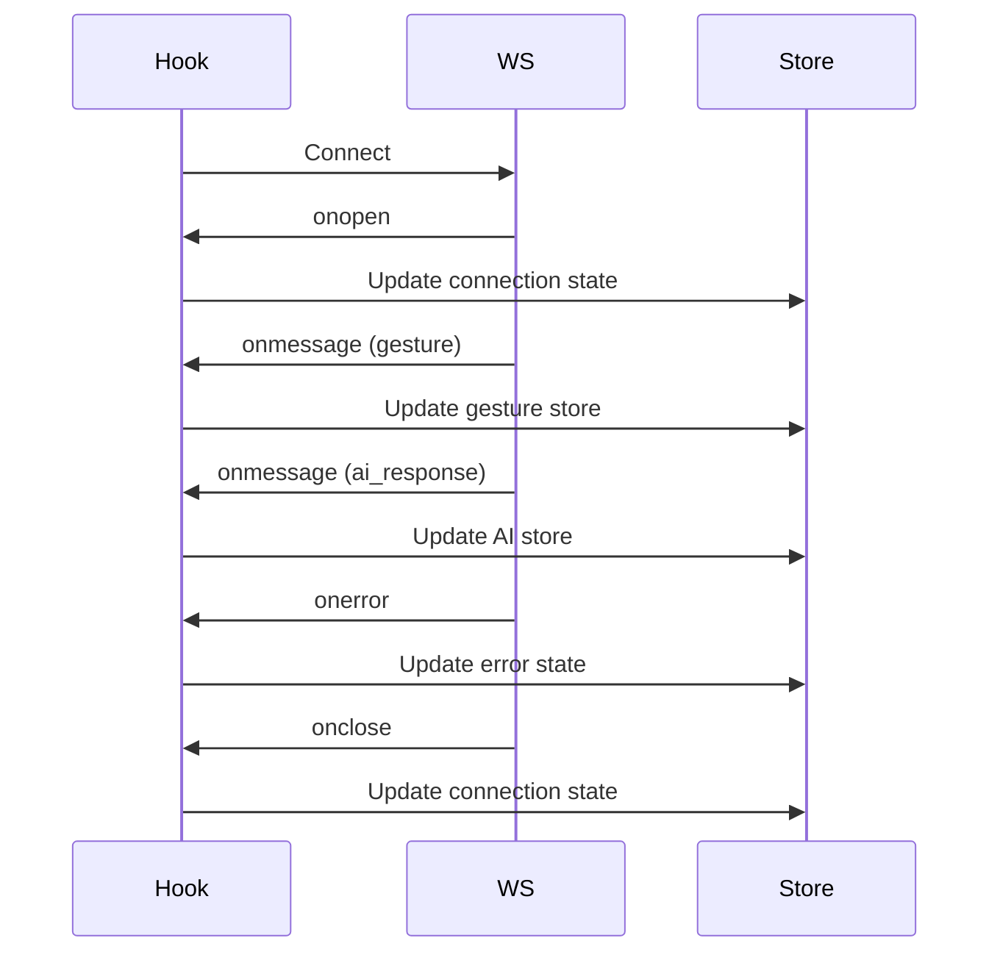

**Features:**
- Automatic reconnection on disconnect
- Message type routing
- Connection state management
- Error handling and logging

---

## Component Communication

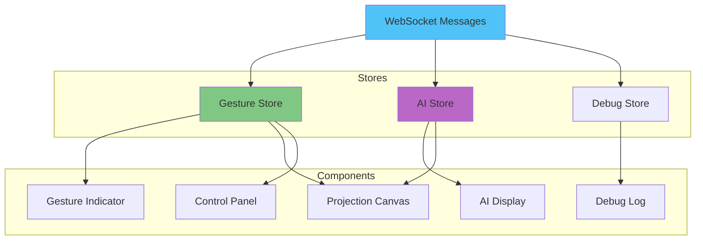

**Data Flow:**
1. WebSocket receives message
2. Hook routes to appropriate store
3. Store updates state
4. Components re-render reactively
5. UI reflects new state

---

## Styling and Theme

### CSS Variables

```css
:root {
  --bg-primary: #0a0a0a;
  --bg-secondary: #1a1a1a;
  --bg-tertiary: #2a2a2a;
  
  --text-primary: #ffffff;
  --text-secondary: #b0b0b0;
  --text-tertiary: #808080;
  
  --accent-primary: #4fc3f7;
  --accent-secondary: #81c784;
  --accent-ai: #ba68c8;
  
  --success: #4caf50;
  --warning: #ff9800;
  --error: #f44336;
  --info: #2196f3;
}
```

### Component Styling

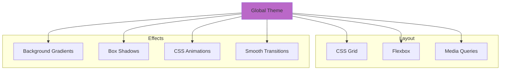

---

## Performance Optimization

### 1. React Optimization
- `React.memo()` for pure components
- `useMemo()` for expensive calculations
- `useCallback()` for stable function references
- Virtual scrolling for long lists

### 2. WebGL Optimization
- Geometry instancing for repeated objects
- Level of detail (LOD) switching
- Frustum culling
- Texture compression

### 3. State Updates
- Debounced gesture updates
- Batched WebSocket messages
- Selective re-renders with Zustand

---

## Testing Strategy

### Unit Tests
- Component rendering
- Store actions
- Hook behavior
- Utility functions

### Integration Tests
- WebSocket message handling
- API service calls
- Store-component interaction

### E2E Tests (Playwright)
- User gesture flow
- AI query flow
- Error handling

---

*Last updated: 2025-12-21*
