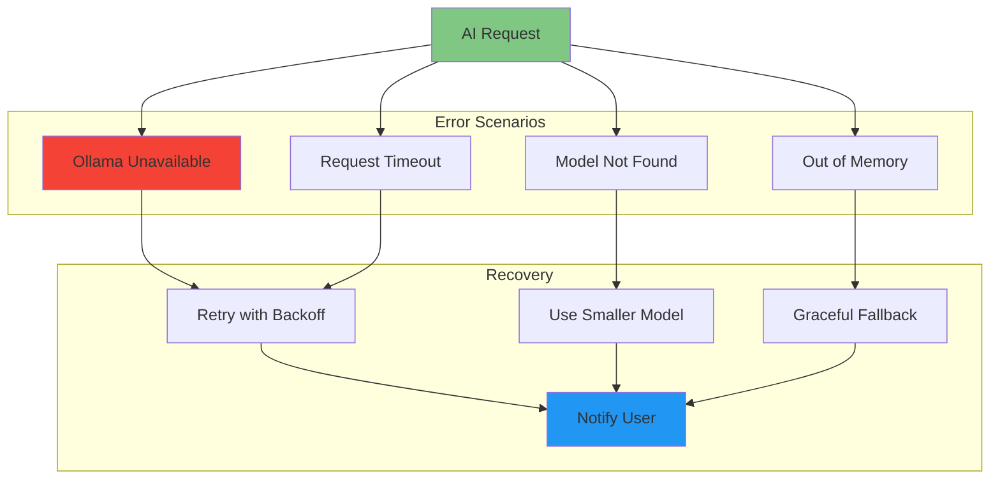

# AI Inference Flow

Detailed flow of AI inference from query to response, including timing analysis.

## Complete AI Flow Overview

```mermaid
graph LR
    Trigger[Gesture<br/>Trigger] -->|~10ms| Backend
    Backend[Backend<br/>Processing] -->|~5ms| AIService
    AIService[AI<br/>Service] -->|~20ms| Ollama
    Ollama[Ollama<br/>API] -->|~1000ms| Generate
    Generate[Text<br/>Generation] -->|~10ms| Response
    Response[Format<br/>Response] -->|~5ms| Broadcast
    Broadcast[WebSocket<br/>Broadcast] -->|~5ms| Frontend
    Frontend[Frontend<br/>Update] -->|~16ms| Render
    Render[UI<br/>Render]

    style Trigger fill:#81c784
    style Ollama fill:#ba68c8
    style Generate fill:#9c27b0
    style Frontend fill:#4fc3f7
```



**Total Latency:**
- 3B model: ~300-400ms
- 7B model: ~1000-1200ms
- 13B model: ~2000-3000ms

---

## Ollama API Integration

### Generation Request

```json
POST http://localhost:11434/api/generate

{
  "model": "llama3.2:latest",
  "prompt": "Complete prompt text here",
  "stream": false,
  "options": {
    "temperature": 0.7,
    "top_p": 0.9,
    "num_predict": 100
  }
}
```

### Response Format

```json
{
  "model": "llama3.2:latest",
  "created_at": "2025-12-21T21:00:00Z",
  "response": "AI generated text response",
  "done": true,
  "context": [1, 2, 3, ...],
  "total_duration": 1234567890,
  "load_duration": 123456,
  "prompt_eval_count": 45,
  "prompt_eval_duration": 234567,
  "eval_count": 67,
  "eval_duration": 987654
}
```

### Streaming Response

```
POST http://localhost:11434/api/generate
{ "model": "llama3.2:latest", "prompt": "...", "stream": true }

Response (Server-Sent Events):
{"model":"llama3.2:latest","created_at":"...","response":"Hello","done":false}
{"model":"llama3.2:latest","created_at":"...","response":" there","done":false}
{"model":"llama3.2:latest","created_at":"...","response":"!","done":true}
```

---

## Timing Breakdown

| Stage | Operation | 3B Model | 7B Model | 13B Model |
|-------|-----------|----------|----------|-----------|
| 1 | Trigger Processing | 10ms | 10ms | 10ms |
| 2 | AIService Init Check | 5ms | 5ms | 5ms |
| 3 | Prompt Construction | 5ms | 5ms | 5ms |
| 4 | HTTP Request | 10ms | 10ms | 10ms |
| 5 | Model Loading | 50ms | 100ms | 200ms |
| 6 | Prompt Evaluation | 50ms | 150ms | 300ms |
| 7 | Text Generation | 200ms | 800ms | 1800ms |
| 8 | Response Processing | 5ms | 5ms | 5ms |
| 9 | WebSocket Broadcast | 5ms | 5ms | 5ms |
| 10 | Frontend Update | 16ms | 16ms | 16ms |
| **Total** | **End-to-End** | **356ms** | **1111ms** | **2356ms** |

---

## Performance Optimization

### 1. Model Selection

**3B Model (Recommended for Real-time):**
- Fast inference (~300-400ms)
- Lower quality responses
- Good for quick interactions

**7B Model (Balanced):**
- Medium inference (~1000-1200ms)
- High quality responses
- Default recommendation

**13B Model (Highest Quality):**
- Slow inference (~2000-3000ms)
- Highest quality responses
- Use for complex queries only

### 2. GPU Acceleration

**CPU-only:**
- 7B model: ~1200ms per query

**With NVIDIA GPU:**
- 7B model: ~300ms per query (4x faster)

**Configuration:**
```bash
# Enable GPU in Ollama
export OLLAMA_GPU=1
export OLLAMA_NUM_GPU=1
```

### 3. Model Caching

Keep model loaded in memory:
```bash
# Ollama automatically caches loaded models
# First query: slower (model loading)
# Subsequent queries: faster (cached)
```

### 4. Context Window Optimization

Limit context size to reduce prompt evaluation time:
```typescript
const MAX_CONTEXT_LENGTH = 2000; // characters
const MAX_QUERY_LENGTH = 5000; // characters
```

---

## Error Handling



**Error Messages:**
```typescript
{
  query: "Wave gesture detected",
  response: "AI service is currently unavailable. Wave gesture was recognized successfully.",
  metadata: { error: true },
  timestamp: Date.now()
}
```

---

*Last updated: 2025-12-21*
