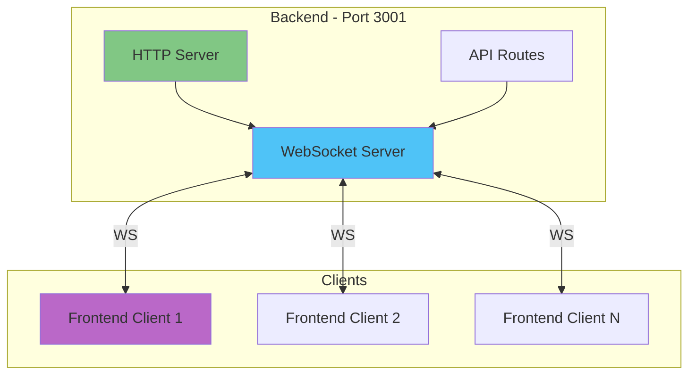
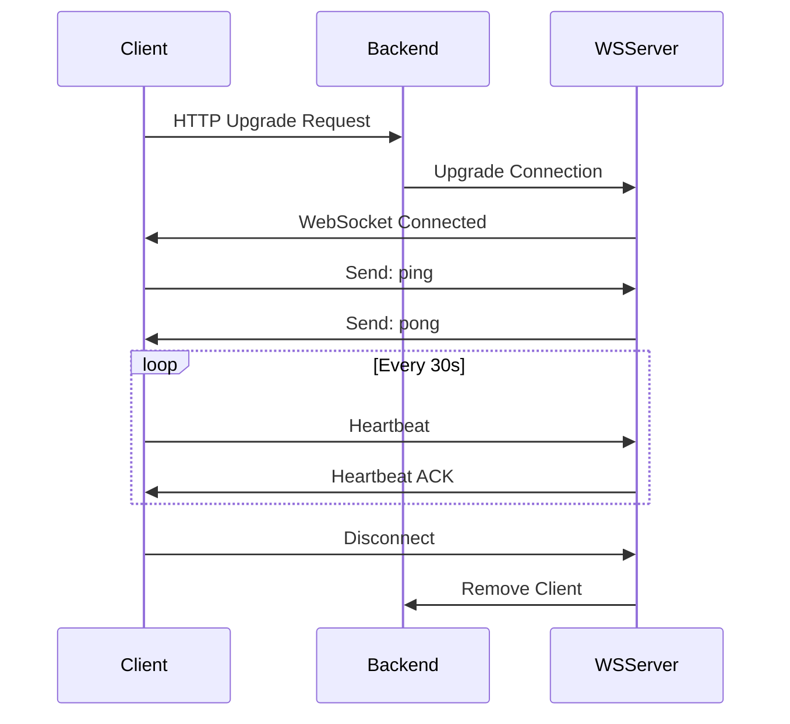
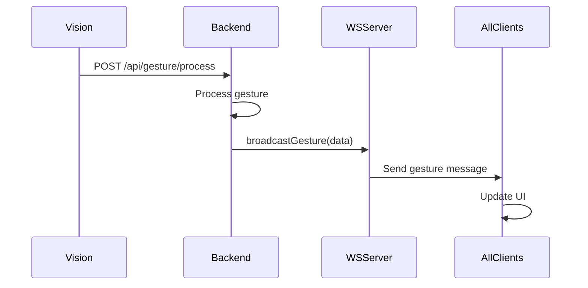
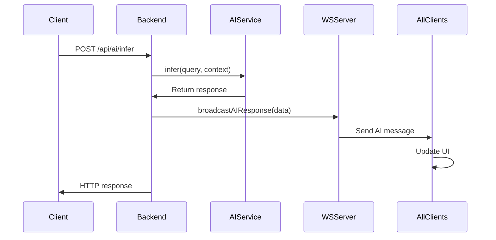
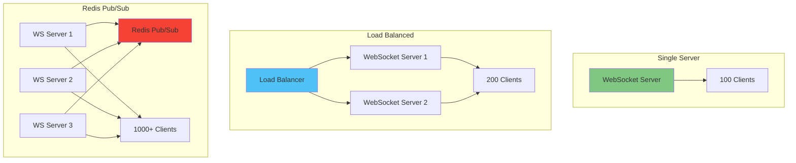

# WebSocket Message Flow

Detailed flow of WebSocket communication between backend and frontend clients.

## WebSocket Architecture



---

## Connection Flow



### Connection Establishment

**Client Request:**
```http
GET ws://localhost:3001 HTTP/1.1
Host: localhost:3001
Upgrade: websocket
Connection: Upgrade
Sec-WebSocket-Key: dGhlIHNhbXBsZSBub25jZQ==
Sec-WebSocket-Version: 13
```

**Server Response:**
```http
HTTP/1.1 101 Switching Protocols
Upgrade: websocket
Connection: Upgrade
Sec-WebSocket-Accept: s3pPLMBiTxaQ9kYGzzhZRbK+xOo=
```

---

## Message Types

### 1. Gesture Messages

Broadcast when a gesture is detected.

**Message Format:**
```json
{
  "type": "gesture",
  "data": {
    "type": "wave",
    "position": {
      "x": 0.5,
      "y": 0.5
    },
    "confidence": 0.92,
    "timestamp": 1640000000000
  }
}
```

**Flow:**


---

### 2. AI Response Messages

Broadcast when AI generates a response.

**Message Format:**
```json
{
  "type": "ai_response",
  "data": {
    "query": "What is gesture recognition?",
    "response": "Gesture recognition is a technology that interprets human gestures using computer vision and machine learning...",
    "metadata": {
      "model": "llama3.2:latest",
      "inferenceTime": 1234,
      "tokenCount": 45
    },
    "timestamp": 1640000000000
  }
}
```

**Flow:**


---

### 3. System Messages

Broadcast for system events and status updates.

**Message Format:**
```json
{
  "type": "system",
  "data": {
    "event": "service_started",
    "service": "vision",
    "message": "Vision service connected",
    "timestamp": 1640000000000
  }
}
```

**Event Types:**
- `service_started` - Service came online
- `service_stopped` - Service went offline
- `connection_count` - Client count changed
- `status_update` - General status update

---

### 4. Error Messages

Broadcast when errors occur.

**Message Format:**
```json
{
  "type": "error",
  "data": {
    "error": "Camera unavailable",
    "details": "Failed to access camera device /dev/video0",
    "code": "CAMERA_ERROR",
    "timestamp": 1640000000000
  }
}
```

**Error Codes:**
- `CAMERA_ERROR` - Camera access failed
- `AI_ERROR` - AI service unavailable
- `NETWORK_ERROR` - Network communication failed
- `VALIDATION_ERROR` - Invalid data received

---

## Client-to-Server Messages

### 1. Subscribe Message

Subscribe to specific message types.

**Request:**
```json
{
  "type": "subscribe",
  "channels": ["gesture", "ai_response", "system"]
}
```

**Response:**
```json
{
  "type": "subscribed",
  "channels": ["gesture", "ai_response", "system"],
  "timestamp": 1640000000000
}
```

---

### 2. Unsubscribe Message

Unsubscribe from message types.

**Request:**
```json
{
  "type": "unsubscribe",
  "channels": ["system"]
}
```

**Response:**
```json
{
  "type": "unsubscribed",
  "channels": ["system"],
  "timestamp": 1640000000000
}
```

---

### 3. Ping Message

Keep-alive ping.

**Request:**
```json
{
  "type": "ping"
}
```

**Response:**
```json
{
  "type": "pong",
  "timestamp": 1640000000000
}
```

---

## Broadcasting Patterns

### 1. Broadcast to All Clients

```typescript
class WebSocketService {
  private clients: Set<WebSocket> = new Set();

  broadcastGesture(gesture: GestureData): void {
    const message = JSON.stringify({
      type: 'gesture',
      data: gesture
    });

    this.clients.forEach(client => {
      if (client.readyState === WebSocket.OPEN) {
        client.send(message);
      }
    });
  }
}
```

---

### 2. Selective Broadcasting

```typescript
broadcastToSubscribed(
  messageType: string,
  data: any
): void {
  const message = JSON.stringify({
    type: messageType,
    data
  });

  this.clients.forEach(client => {
    const subscriptions = this.subscriptions.get(client);
    if (subscriptions?.has(messageType)) {
      if (client.readyState === WebSocket.OPEN) {
        client.send(message);
      }
    }
  });
}
```

---

### 3. Targeted Messages

```typescript
sendToClient(clientId: string, message: any): void {
  const client = this.getClientById(clientId);
  if (client && client.readyState === WebSocket.OPEN) {
    client.send(JSON.stringify(message));
  }
}
```

---

## Connection Management

### Client Tracking

```typescript
class WebSocketService {
  private clients: Set<WebSocket> = new Set();
  private clientMetadata: Map<WebSocket, ClientInfo> = new Map();

  handleConnection(ws: WebSocket, req: IncomingMessage): void {
    const clientId = generateClientId();
    const clientInfo: ClientInfo = {
      id: clientId,
      ip: req.socket.remoteAddress,
      connectedAt: Date.now(),
      subscriptions: new Set(['gesture', 'ai_response'])
    };

    this.clients.add(ws);
    this.clientMetadata.set(ws, clientInfo);

    logger.info(`Client connected: ${clientId}`);

    ws.on('message', (data) => this.handleMessage(ws, data));
    ws.on('close', () => this.handleDisconnect(ws));
    ws.on('error', (error) => this.handleError(ws, error));
  }

  getClientCount(): number {
    return this.clients.size;
  }
}
```

---

### Heartbeat Mechanism

```typescript
class WebSocketService {
  private heartbeatInterval = 30000; // 30 seconds

  startHeartbeat(): void {
    setInterval(() => {
      this.clients.forEach(client => {
        if (client.readyState === WebSocket.OPEN) {
          client.ping();
        } else {
          this.removeClient(client);
        }
      });
    }, this.heartbeatInterval);
  }
}
```

---

## Performance Characteristics

### Latency

| Operation | Latency |
|-----------|---------|
| Message serialization | ~1ms |
| Network transmission (local) | ~3-5ms |
| Client message handling | ~2ms |
| **Total roundtrip** | **~10ms** |

### Throughput

| Metric | Capacity |
|--------|----------|
| Messages per second | 10,000+ |
| Concurrent clients | 100+ |
| Message size (max) | 1MB |
| Broadcast time (100 clients) | ~50ms |

### Scalability



---

## Error Handling

### Connection Errors

```typescript
handleError(ws: WebSocket, error: Error): void {
  logger.error('WebSocket error:', error);
  
  // Attempt to notify client
  try {
    ws.send(JSON.stringify({
      type: 'error',
      data: {
        error: 'Connection error',
        details: error.message,
        timestamp: Date.now()
      }
    }));
  } catch (sendError) {
    // Client likely disconnected
    this.removeClient(ws);
  }
}
```

### Reconnection Strategy

**Client-side:**
```typescript
class ReconnectingWebSocket {
  private reconnectDelay = 1000;
  private maxReconnectDelay = 30000;
  private reconnectAttempts = 0;

  connect(): void {
    this.ws = new WebSocket(this.url);

    this.ws.onclose = () => {
      const delay = Math.min(
        this.reconnectDelay * Math.pow(2, this.reconnectAttempts),
        this.maxReconnectDelay
      );

      setTimeout(() => {
        this.reconnectAttempts++;
        this.connect();
      }, delay);
    };

    this.ws.onopen = () => {
      this.reconnectAttempts = 0;
    };
  }
}
```

---

## Security Considerations

### 1. Authentication (Future)

```typescript
// Validate token on connection
handleConnection(ws: WebSocket, req: IncomingMessage): void {
  const token = req.headers['sec-websocket-protocol'];
  
  if (!this.validateToken(token)) {
    ws.close(1008, 'Unauthorized');
    return;
  }
  
  // Continue with connection
}
```

### 2. Rate Limiting

```typescript
// Limit messages per client
handleMessage(ws: WebSocket, data: any): void {
  const clientInfo = this.clientMetadata.get(ws);
  
  if (this.isRateLimited(clientInfo)) {
    ws.send(JSON.stringify({
      type: 'error',
      data: {
        error: 'Rate limit exceeded',
        code: 'RATE_LIMIT'
      }
    }));
    return;
  }
  
  // Process message
}
```

### 3. Message Validation

```typescript
handleMessage(ws: WebSocket, data: any): void {
  try {
    const message = JSON.parse(data.toString());
    
    if (!this.validateMessage(message)) {
      throw new Error('Invalid message format');
    }
    
    this.processMessage(ws, message);
  } catch (error) {
    ws.send(JSON.stringify({
      type: 'error',
      data: {
        error: 'Invalid message',
        code: 'VALIDATION_ERROR'
      }
    }));
  }
}
```

---

## Monitoring

### Connection Metrics

```typescript
getMetrics(): WebSocketMetrics {
  return {
    activeConnections: this.clients.size,
    totalMessages: this.messageCount,
    messagesPerSecond: this.calculateMPS(),
    averageLatency: this.calculateAvgLatency(),
    errorRate: this.calculateErrorRate()
  };
}
```

### Logging

```typescript
// Connection events
logger.info(`Client connected: ${clientId} from ${ip}`);
logger.info(`Client disconnected: ${clientId} (duration: ${duration}ms)`);

// Message events
logger.debug(`Broadcast gesture to ${clientCount} clients`);
logger.debug(`AI response sent to ${clientCount} clients`);

// Error events
logger.error(`WebSocket error for client ${clientId}:`, error);
logger.warn(`Client ${clientId} rate limited`);
```

---

*Last updated: 2025-12-21*
