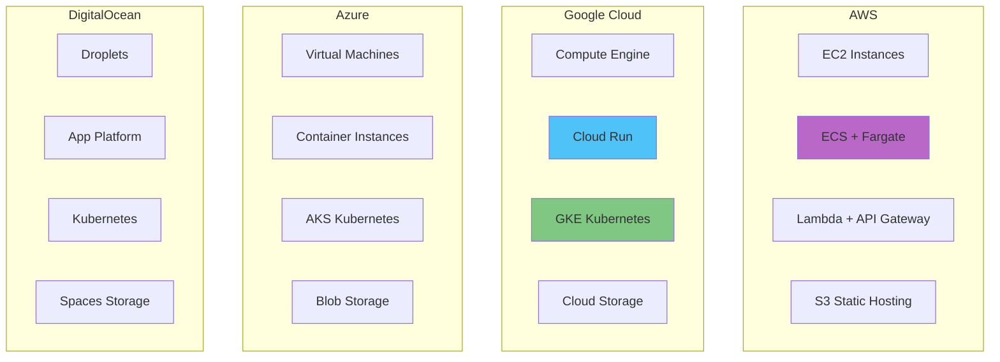
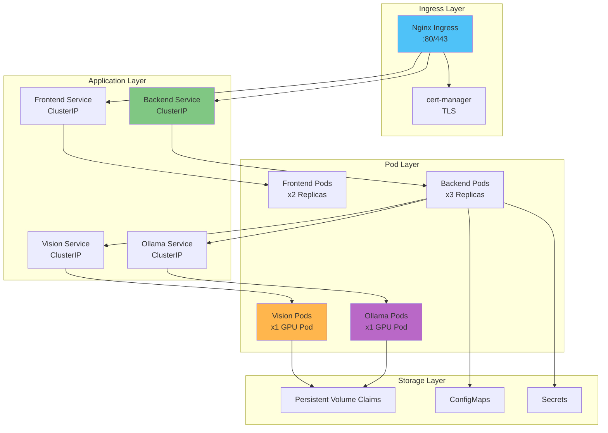
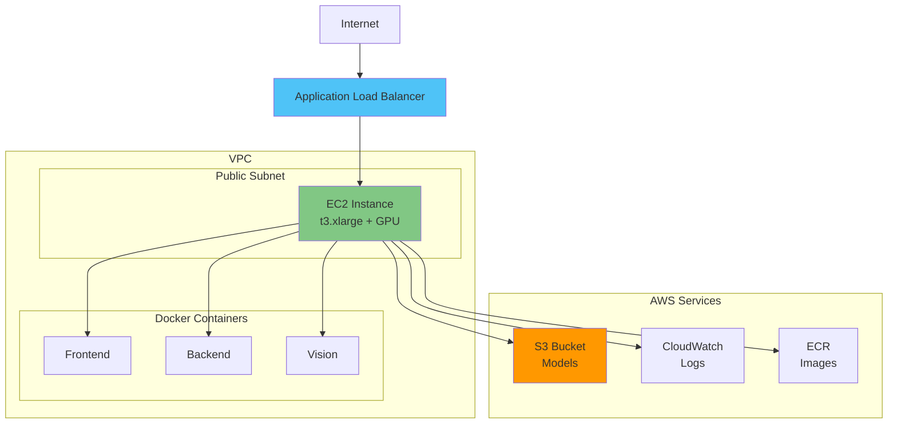
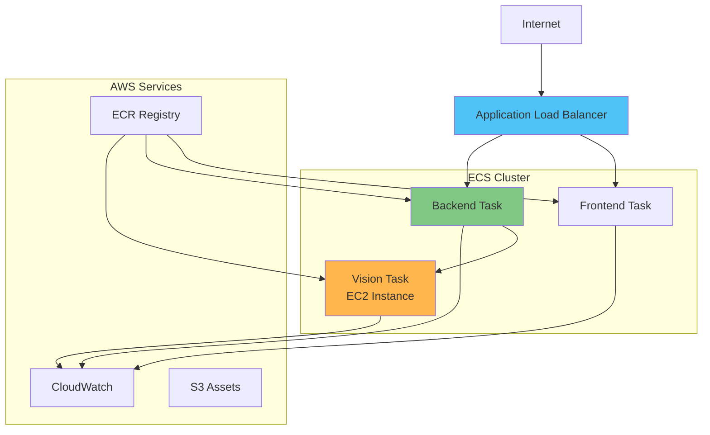
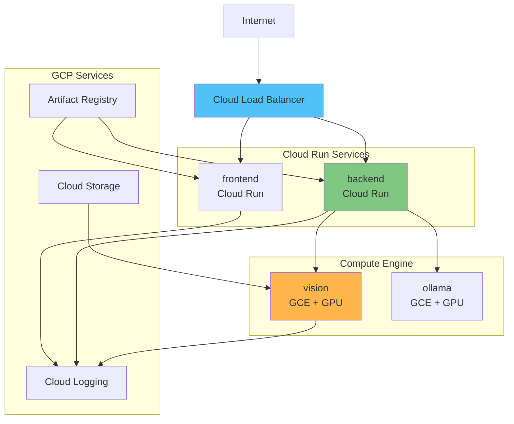
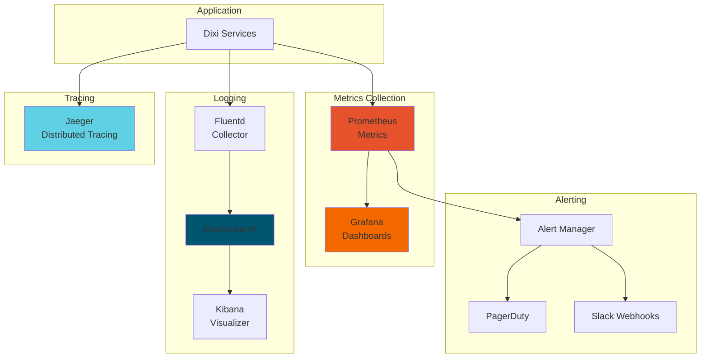
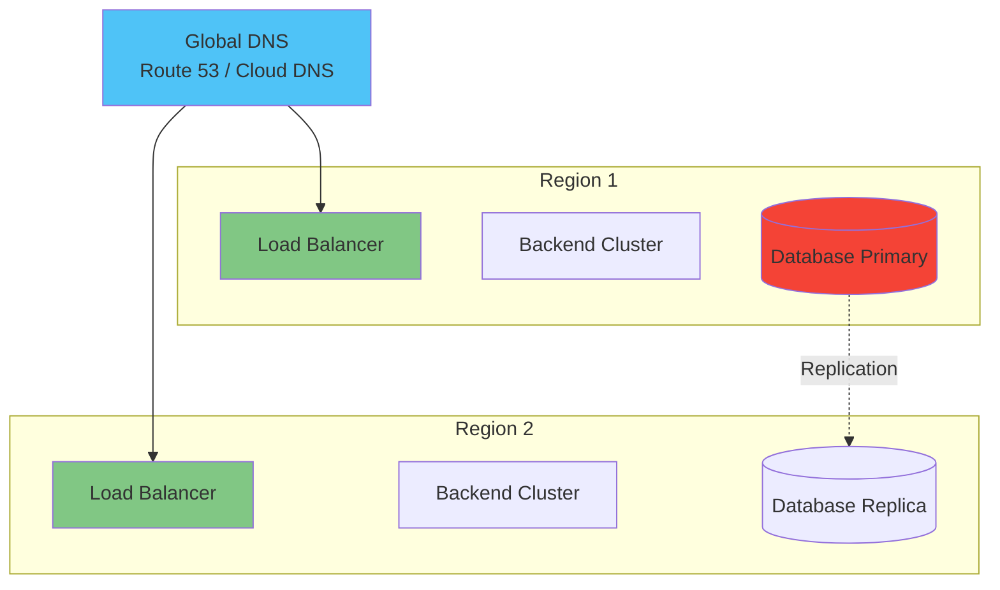

# Deployment Architecture

Production deployment architecture and infrastructure patterns.

## Cloud Deployment Options



---

## Docker Compose Deployment

### Architecture

```mermaid
graph TB
    subgraph "Docker Host"
        Network[dixi-network]
        
        subgraph "Containers"
            Frontend[frontend<br/>nginx:alpine]
            Backend[backend<br/>node:20]
            Vision[vision<br/>python:3.10]
        end

        subgraph "Volumes"
            Models[models/]
            Logs[logs/]
        end

        subgraph "Host Resources"
            Ollama[Ollama<br/>:11434]
            Camera[/dev/video0]
        end
    end

    Network --- Frontend
    Network --- Backend
    Network --- Vision

    Backend --> Ollama
    Backend --> Vision
    Vision --> Camera

    Backend --> Logs
    Vision --> Models

    style Network fill:#4fc3f7
    style Backend fill:#81c784
    style Vision fill:#ffb74d
```

### Configuration

**docker-compose.yml:**
```yaml
version: '3.8'

services:
  frontend:
    build: ./packages/frontend
    ports:
      - "5173:80"
    environment:
      - VITE_API_URL=http://backend:3001
    depends_on:
      - backend
    networks:
      - dixi-network

  backend:
    build: ./packages/backend
    ports:
      - "3001:3001"
    environment:
      - NODE_ENV=production
      - VISION_SERVICE_URL=http://vision:5000
      - OLLAMA_BASE_URL=http://host.docker.internal:11434
    depends_on:
      - vision
    networks:
      - dixi-network
    volumes:
      - ./logs:/app/logs

  vision:
    build: ./packages/vision
    ports:
      - "5000:5000"
    environment:
      - BACKEND_URL=http://backend:3001
    devices:
      - /dev/video0:/dev/video0
    networks:
      - dixi-network
    volumes:
      - ./models:/app/models

networks:
  dixi-network:
    driver: bridge
```

---

## Kubernetes Deployment

### Architecture



### Manifests

**namespace.yaml:**
```yaml
apiVersion: v1
kind: Namespace
metadata:
  name: dixi
```

**backend-deployment.yaml:**
```yaml
apiVersion: apps/v1
kind: Deployment
metadata:
  name: backend
  namespace: dixi
spec:
  replicas: 3
  selector:
    matchLabels:
      app: backend
  template:
    metadata:
      labels:
        app: backend
    spec:
      containers:
      - name: backend
        image: dixi/backend:latest
        ports:
        - containerPort: 3001
        env:
        - name: NODE_ENV
          value: "production"
        - name: VISION_SERVICE_URL
          value: "http://vision-service:5000"
        - name: OLLAMA_BASE_URL
          value: "http://ollama-service:11434"
        resources:
          requests:
            memory: "512Mi"
            cpu: "500m"
          limits:
            memory: "1Gi"
            cpu: "1000m"
        livenessProbe:
          httpGet:
            path: /api/health/live
            port: 3001
          initialDelaySeconds: 30
          periodSeconds: 10
        readinessProbe:
          httpGet:
            path: /api/health/ready
            port: 3001
          initialDelaySeconds: 10
          periodSeconds: 5
```

**backend-service.yaml:**
```yaml
apiVersion: v1
kind: Service
metadata:
  name: backend-service
  namespace: dixi
spec:
  selector:
    app: backend
  ports:
  - protocol: TCP
    port: 3001
    targetPort: 3001
  type: ClusterIP
```

**vision-deployment.yaml:**
```yaml
apiVersion: apps/v1
kind: Deployment
metadata:
  name: vision
  namespace: dixi
spec:
  replicas: 1
  selector:
    matchLabels:
      app: vision
  template:
    metadata:
      labels:
        app: vision
    spec:
      containers:
      - name: vision
        image: dixi/vision:latest
        ports:
        - containerPort: 5000
        resources:
          requests:
            nvidia.com/gpu: 1
          limits:
            nvidia.com/gpu: 1
        volumeMounts:
        - name: models
          mountPath: /app/models
        - name: camera
          mountPath: /dev/video0
      volumes:
      - name: models
        persistentVolumeClaim:
          claimName: models-pvc
      - name: camera
        hostPath:
          path: /dev/video0
```

**ingress.yaml:**
```yaml
apiVersion: networking.k8s.io/v1
kind: Ingress
metadata:
  name: dixi-ingress
  namespace: dixi
  annotations:
    cert-manager.io/cluster-issuer: letsencrypt-prod
    nginx.ingress.kubernetes.io/websocket-services: backend-service
spec:
  ingressClassName: nginx
  tls:
  - hosts:
    - dixi.example.com
    secretName: dixi-tls
  rules:
  - host: dixi.example.com
    http:
      paths:
      - path: /api
        pathType: Prefix
        backend:
          service:
            name: backend-service
            port:
              number: 3001
      - path: /
        pathType: Prefix
        backend:
          service:
            name: frontend-service
            port:
              number: 80
```

---

## AWS Deployment

### EC2 + Docker



### ECS + Fargate



---

## Google Cloud Deployment

### Cloud Run



### GKE (Google Kubernetes Engine)

Similar to Kubernetes deployment above, but with GCP-specific features:
- **Cloud Load Balancer** for ingress
- **Persistent Disks** for storage
- **Cloud Monitoring** integration
- **Workload Identity** for authentication

---

## Monitoring & Observability



---

## High Availability Setup



**Features:**
- Multi-region deployment
- Active-active load balancing
- Database replication
- Automatic failover
- Health-based routing

---

## Cost Estimation

### AWS (Monthly)

| Component | Instance Type | Cost |
|-----------|--------------|------|
| Backend (EC2) | t3.medium x2 | $60 |
| Vision (EC2) | g4dn.xlarge x1 | $400 |
| Ollama (EC2) | g4dn.xlarge x1 | $400 |
| Load Balancer | ALB | $20 |
| S3 Storage | 100GB | $2 |
| CloudWatch | Logs + Metrics | $10 |
| **Total** | | **~$892/month** |

### Google Cloud (Monthly)

| Component | Service | Cost |
|-----------|---------|------|
| Backend | Cloud Run | $40 |
| Vision | GCE n1-standard-4 + GPU | $450 |
| Ollama | GCE n1-standard-4 + GPU | $450 |
| Load Balancer | Cloud LB | $18 |
| Storage | Cloud Storage 100GB | $2 |
| Logging | Cloud Logging | $10 |
| **Total** | | **~$970/month** |

### DigitalOcean (Monthly)

| Component | Droplet | Cost |
|-----------|---------|------|
| Backend | 4GB RAM x2 | $48 |
| Vision | 8GB RAM + GPU | $300 |
| Ollama | 8GB RAM + GPU | $300 |
| Load Balancer | DO LB | $12 |
| Spaces Storage | 100GB | $5 |
| **Total** | | **~$665/month** |

---

*Last updated: 2025-12-21*
