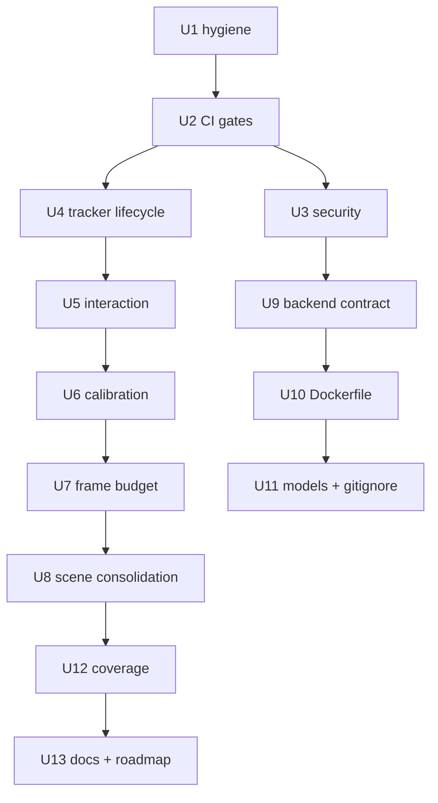

# Review Fix Round - Plan

## Goal Capsule

- **Objective:** The browser-vision rebuild phase (bf61a75 → a8f0e84) passes the bar the code review set: the eight P1s and their grouped P2/P3s are fixed and verified, so the v0.3 milestone can be called done honestly.
- **Means:** One fix branch, one PR, atomic commits ordered by the review's triage groups — verification gates first so every later fix is actually gated (KTD1).
- **Authority:** `AGENTS.md` cardinal rules + luke-agents constitution > this plan > review report findings. Where a finding and a cardinal rule conflict, the cardinal rule wins.
- **Execution profile:** Surgical fixes, not redesign. No new features, no v0.4 work. Findings are evidence to validate during implementation, not blindly applied.
- **Stop conditions:** a fix requires redesigning tracking architecture (escalate); a "fix" breaks the live camera path that currently works; scope creep beyond the finding list.
- **Who finishes:** the executing agent implements, tests, and ships the PR; Luke reviews the CORS/scene-canon decisions if implementation surfaces new information.

---

## Product Contract

### Summary

A full-agent code review of the browser-vision rebuild returned **Not ready** with 30 primary findings (8 P1). This plan fixes all 28 confirmed findings plus the flagged pre-existing items that share the same touchpoints, in triage-group order, each with regression tests, landing as a single PR.

### Problem Frame

The rebuild shipped working browser-native vision — verified live at 30–42fps with real camera frames — but the review found the surrounding machinery is weak: the frontend CI job gates nothing, two fail-open security defaults compose into drive-by admin access, the tracker's async start/stop races leak camera streams, the pinch interaction livelocks the render thread, calibration can persist poisoned state, and the Docker image builds green while serving an empty directory. None of these need redesign; all are localized defects in the phase's new surface or its immediate neighbors.

### Key Decisions

- **Fail-closed CORS.** Backend CORS defaults to an explicit localhost allowlist; `FRONTEND_URL` extends it. LAN-origin credentialed access is not a requirement — browser-vision mode needs no backend, and server mode can set the env var explicitly. (session-settled: user-approved — chosen over a LAN allowlist: Dixi is LAN-deployed but the credentialed surface is admin/AI routes a kiosk UI doesn't need cross-origin.) Governs R3.
- **GestureShapes is canonical.** `ProjectionShapes` is deleted; the canvas-based scenes own cursor rendering for both vision modes (both feed the same `trackingStore`). (session-settled: user-approved — chosen over remounting the orphaned component: three parallel implementations were the defect.) Governs R22, R23.
- **Fix round, not fix series.** All findings land on one branch with atomic commits per unit in one PR. (session-settled: user-approved — the findings interlock and CI, not review bandwidth, is the bottleneck.) Governs sequencing.

### Requirements

**Verification gates**

- R1. The frontend CI job runs `tsc --noEmit` (via `build:check`) and `vitest run` scoped to the green suite; the 5 legacy-red ControlPanel tests are either fixed or explicitly quarantined with a tracked issue — never silently deferred. (findings #1)
- R2. `release.yml` test steps fail the job when tests fail — no `|| echo` soft-fail remains. (finding #38)

**Security defaults**

- R3. CORS origin is an explicit allowlist (localhost in dev, `FRONTEND_URL` when set); credentials only for allowlisted origins. No reflect-any-origin fallback. (finding #5)
- R4. Admin auth requires `x-api-key` header against a configured `ADMIN_API_KEY`; no published fallback value and no query-string credential. When the key is unset the admin API returns an explicit unavailable response. (finding #6)
- R5. The Gemini API key travels in the request header, not the URL; error logging never includes the axios config/URL. (finding #37)
- R6. Admin endpoints that are not implemented return `501` rather than `200` with "not yet implemented" bodies. (finding #39; AGENTS.md cardinal rule 1)

**Tracker lifecycle**

- R7. `start()`/`stop()` are serialized by a monotonic generation token; a stale in-flight start cannot resurrect `running`, leak its stream, or spawn a second pump. (finding #4)
- R8. When both MediaPipe delegates fail, `start()` propagates an error to `error` status — never `running` with a dead pump. (finding #8)
- R9. A start that fails after `getUserMedia` stops the acquired tracks. (finding #19)
- R10. Pump errors dedupe (no per-frame store spam) and a consecutive-failure cutoff stops the pump instead of burning the thread. (finding #21)

**Interaction**

- R11. Launcher's Calibrate button closes the launcher so the overlay is visible. (finding #3)
- R12. `GestureShapes` does not setState on zero-delta drags and holds no unstable-array effect dependency — pinch-drag cannot livelock. (finding #7)

**Calibration**

- R13. A dwell point arms the next target only after the fingertip departs the captured anchor; `addCalibrationPoint` refuses input when inactive or already holding 4 points. (finding #10)
- R14. Persisted calibration is validated on load (finite numbers, exactly 4 points, homography shape); corrupt-but-parseable payloads are discarded. (finding #24)
- R15. The "Calibrated" success flash actually paints before the overlay unmounts. (finding #9)
- R16. `cancelCalibration` restores the state snapshotted when calibration began, not the module-load state. (finding #33)
- R17. Video `srcObject` attaches exactly once per stream in both preview paths, via a shared comparison/hook. (findings #16, #25, #29)

**Frame budget**

- R18. Scene canvases resize their backing buffer only on real viewport/DPR change and reuse a cached 2D context; per-frame work is `clearRect`. (finding #11)
- R19. Inference runs only on new camera frames (`requestVideoFrameCallback` preferred, `currentTime` comparison as fallback). (finding #20)
- R20. `VisionHUD` and `CalibrationOverlay` subscribe to narrow store selectors, not whole-store inference-rate updates. (findings #30, #28)
- R21. The frame-budget guardrail warns when inference > 33ms or fps < 24, per the ROADMAP v0.3 line item. (roadmap gap)

**Scene consolidation**

- R22. `ProjectionShapes` is deleted; its useful tests move to the shared helper or canonical scene. (finding #12)
- R23. `normalizeCoordinate`, `HAND_COLOR`, and the cursor-draw scaffold live in one shared module consumed by the scene components. (finding #2)

**Backend contract**

- R24. AI gesture context calls `GET /gesture/projector` (the route Flask actually serves) or the call is removed if the context is unused. (finding #13)
- R25. All axios calls to the vision service carry explicit bounded timeouts (`/tracking/start|stop`, `/face/start|stop`). (findings #14, #41)
- R26. `tracking` and `face` POST bodies are validated before broadcast to WebSocket clients. (finding #40; AGENTS.md: never trust client gesture data)
- R27. `index.ts` stops exporting permanently-null `wss`/`wsService` bindings; dead `jest.mock('../../index')` calls in route tests are removed. (findings #26, #27)
- R28. WebSocket client reconnect has a max-attempts cap on all paths, not only the catch path. (finding #42)

**Deployment and assets**

- R29. The frontend image serves the built `dist` directory — verified by running the image, not just building it. (finding #35)
- R30. Vendored `.task` weights carry a version+sha256 provenance manifest; `hand_landmarker.task` is wired or removed. (finding #15; CLAUDE.md: version-pin all model weights)
- R31. `.gitignore` covers the AGENTS.md mandatory set (`.env.*.local`, `*.pem`, `*.key`, `*.p12`, `*.pfx`, `service-account*.json`, `*.py[cod]`, `.venv/`). (finding #36)

**Coverage and docs**

- R32. Every fixed path carries a regression test in the same change; scene state machines, handedness/mirror mapping, and calibration lifecycle gain real suites. (findings #17, #18, #23)
- R33. "Web Worker" claims in comments/docs/types are corrected to main-thread reality; dead exported types are removed; ROADMAP reflects the true gate status. (finding #32)

### Scope Boundaries

**Deferred for later:** auto-calibration, occlusion masking, AI ask-path, gesture record/playback (v0.4); `registerScene()` SDK, third showcase scene (v0.5); LAN-allowlist CORS if a real deployment needs it.

**Outside this product's identity:** accounts, cloud storage, mobile app, Kubernetes, multi-user.

### Sources

- Code review report (30 primary findings, 28 confirmed): run artifacts under `/tmp/compound-engineering-1000/ce-code-review/20261001-231841-a0a43f1c/` on this machine — finding numbers cited above are from that report.
- `AGENTS.md` cardinal rules + `.gitignore` mandatory set; `CLAUDE.md` model-pinning rule; `ROADMAP.md` v0.3.

---

## Planning Contract

### Key Technical Decisions

- KTD1. **Gate first, fix second.** The CI unit lands before behavior fixes so every subsequent commit is exercised by real vitest + tsc gates, not just local runs. The 5 legacy-red ControlPanel tests get a genuine fix attempt; any that resist are quarantined under `describe.skip` with a `TODO(issue)` pointer and a filed tracking issue — visible, never silent.
- KTD2. **Generation-token serialization.** `TrackerClient`/`browserTrackingSource` get a monotonic `startGeneration` counter incremented on every `start` and `stop`; each awaited step re-checks currency, stale callbacks are no-ops, and teardown compares promise identity in `finally`. One mechanism resolves #4, #8, #19 and simplifies #21's cutoff.
- KTD3. **Shared stream-attach helper.** A single `attachStreamToVideo(video, stream)` (or `useTrackerVideoStream` hook) with stream-identity comparison replaces the two divergent 200ms poll loops in `CameraPreview` and `CalibrationOverlay`. (implements R17)
- KTD4. **Sized-canvas helper.** One `useSizedCanvas` (ref + cached ctx + resize-on-change) shared by `GestureShapes` and `DrawScene` — the two proven consumers. No speculative third abstraction. (implements R18)
- KTD5. **Camera picker lands first as its own commit.** The uncommitted working tree (HUD dropdown, `listCameras`/`setCamera`, persisted `cameraId`, unplug fallback) is verified-tested and committed on the fix branch before U2, keeping it atomic and off the review-diff's scope.
- KTD6. **Localhost-default allowlist with env extension.** CORS reads `FRONTEND_URL` plus a built-in `http://localhost:*`/`http://127.0.0.1:*` dev set; production-unset fails closed. (implements R3 per Product Key Decision)

### Sequencing

U2 precedes all behavior fixes (gate exists first). U5→U8 share `GestureShapes.tsx`, so they stay sequential. U9 is backend-only and can parallel U4–U7. U12/U13 close the round.

---

## Implementation Units

| U | Unit | Key files | Depends on |
|---|------|-----------|------------|
| U1 | Hygiene: camera picker + .gitignore | `visionStore.ts`, `browserTrackingSource.ts`, `VisionHUD.tsx`, `.gitignore` | — |
| U2 | CI/release test gates | `.github/workflows/ci.yml`, `.github/workflows/release.yml`, ControlPanel tests | U1 |
| U3 | Security defaults | `backend/src/index.ts`, `routes/admin.ts`, `services/ai.ts`, `.env.example` | U2 |
| U4 | Tracker lifecycle serialization | `vision/trackerClient.ts`, `vision/browserTrackingSource.ts` | U2 |
| U5 | Interaction unblock | `components/Launcher.tsx`, `components/GestureShapes.tsx` | U4 |
| U6 | Calibration integrity | `components/CalibrationOverlay.tsx`, `vision/visionStore.ts` | U5 |
| U7 | Frame budget | `components/{GestureShapes,VisionHUD,CalibrationOverlay}.tsx`, `scenes/DrawScene.tsx`, `vision/trackerClient.ts` | U6 |
| U8 | Scene consolidation | `components/{GestureShapes,ProjectionShapes}.tsx`, shared scene helpers | U7 |
| U9 | Backend contract + wsService | `backend/src/routes/{ai,gesture,face,tracking}.ts`, `index.ts`, route tests | U3 |
| U10 | Frontend Dockerfile serve path | `packages/frontend/Dockerfile` | U9 |
| U11 | Model provenance | `public/models/` manifest, `.gitignore` leftover | U10 |
| U12 | Coverage suites | `vision/__tests__/`, scene state-machine tests | U8 |
| U13 | Docs + roadmap truth | `vision/types.ts`, `README.md`, `ROADMAP.md`, `CHANGELOG.md` | U12 |

### U1. Hygiene commit: camera picker + .gitignore

- **Goal:** Land the working camera-picker and the mandated ignore patterns before the fix units, so the tree is clean and compliant.
- **Requirements:** R31; preserves the picker behavior (persisted `cameraId`, `listCameras`/`setCamera`, `OverconstrainedError` fallback).
- **Files:** `packages/frontend/src/vision/visionStore.ts`, `packages/frontend/src/vision/browserTrackingSource.ts`, `packages/frontend/src/components/VisionHUD.tsx`, `.gitignore`.
- **Approach:** Commit existing uncommitted picker diff as its own atomic commit. Add the 8 missing `.gitignore` patterns from AGENTS.md's mandatory list.
- **Test scenarios:** picker unit test — `setCamera` while running restarts onto the new id; persisted id missing from `enumerateDevices` falls back to default; `git check-ignore` passes for each added pattern.
- **Verification:** `npx vitest run src/vision` green; `git status --porcelain` shows no ignorable leak paths.

### U2. CI and release test gates

- **Goal:** Frontend and release jobs actually fail when code is broken.
- **Requirements:** R1, R2.
- **Files:** `.github/workflows/ci.yml`, `.github/workflows/release.yml`, `packages/frontend/src/components/ControlPanel/sections/**` (the 5 red tests), `packages/frontend/package.json` (if a `test:ci` script helps).
- **Approach:** Frontend job: replace bare `npm run build` with `npm run build:check` (already defined: `tsc --noEmit && vite build`) plus `npx vitest run`. Diagnose the 5 legacy-red tests (`CalibrationPanel` ×2, `LoggingDashboard`, `GestureControls`, `ModelConfig`) — fix if small; otherwise `describe.skip` each with `TODO(issue)` + filed issue, and scope the CI step to `npx vitest run` (which will then be all-green). `release.yml`: delete the `2>/dev/null || echo` wrapper, run the real root test command (`npm run test:all`).
- **Test scenarios:** a deliberately broken vitest assertion fails the CI step locally (`npx vitest run` nonzero); YAML is valid (`actionlint` or `python -c "import yaml..."`).
- **Verification:** `cd packages/frontend && npx vitest run` exit 0; `npm run build:check` exit 0; no `|| echo` remains in workflows.

### U3. Security defaults

- **Goal:** Default deployment has no drive-by admin path and no key-in-URL logging.
- **Requirements:** R3, R4, R5, R6.
- **Files:** `packages/backend/src/index.ts`, `packages/backend/src/routes/admin.ts`, `packages/backend/src/services/ai.ts`, `.env.example`, `packages/backend/src/routes/__tests__/`.
- **Approach:** CORS: allowlist = `FRONTEND_URL` (when set) ∪ `http://localhost:*`/`127.0.0.1:*` dev origins; reject others. Admin: read `ADMIN_API_KEY` once at module load — unset → middleware returns `503` for all admin routes; auth via `x-api-key` header only; delete `req.query.apiKey`. Add `ADMIN_API_KEY=` placeholder to `.env.example`. Gemini: move key to `x-goog-api-key` header; error logging keeps `status`/`message` only. Stub admin endpoints return `501`.
- **Test scenarios:** supertest-style route tests — credentialed request from `http://evil.example` is rejected; `?apiKey=` is ignored; unset `ADMIN_API_KEY` → `503`; wrong header key → `401`; stub endpoint → `501`; Gemini axios mock asserts key absent from URL.
- **Verification:** `cd packages/backend && npx jest` green; AGENTS.md security checklist grep clean.

### U4. Tracker lifecycle serialization

- **Goal:** start/stop is race-proof; failure states are honest.
- **Requirements:** R7, R8, R9, R10.
- **Files:** `packages/frontend/src/vision/trackerClient.ts`, `packages/frontend/src/vision/browserTrackingSource.ts`, `packages/frontend/src/vision/__tests__/trackerClient.test.ts` (new).
- **Approach:** KTD2 generation token in `TrackerClient.start`: increment per call; after each `await` check `this.generation === mine`, else stop acquired resources and return. `pickDelegate` throws when `winner.r == null`. `start` failure path stops tracks. `browserTrackingSource.start/stop` mirror the token so stale `onReady`/`onError` can't write status. Pump: track `consecutiveFailures`; dedupe identical error messages; stop pump after N consecutive failures → `error` status.
- **Test scenarios:** start→stop during startup leaves no stream, status `idle`; start→stop→start yields exactly one pump and one stream; double-mount starts once; both delegates throw → `error` status, camera off; `getUserMedia` denial → `error`, no tracks; repeated pump failures stop the loop.
- **Verification:** `npx vitest run src/vision` green incl. new lifecycle suite.

### U5. Interaction unblock

- **Goal:** Calibration is reachable from the launcher; pinch-drag can't livelock.
- **Requirements:** R11, R12.
- **Files:** `packages/frontend/src/components/Launcher.tsx`, `packages/frontend/src/components/GestureShapes.tsx`.
- **Approach:** Launcher: `{ beginCalibration(); closeMenu(); }`. GestureShapes: `useMemo` the cursors array on `tracking`; early-return `setShapes` when `dx === 0 && dy === 0`; extract the pure grab/drag transition into a testable function if it stays simple.
- **Test scenarios:** stationary pinch over 60 rendered frames produces ≤1 state write; drag with movement updates once per moved frame; launcher calibrate path leaves launcher closed (component test).
- **Verification:** vitest green; manual smoke — pinch-drag a shape with React DevTools profiler shows no render storm.

### U6. Calibration integrity

- **Goal:** Calibration persists only valid, deliberately-captured state.
- **Requirements:** R13–R17.
- **Files:** `packages/frontend/src/components/CalibrationOverlay.tsx`, `packages/frontend/src/vision/visionStore.ts`, `packages/frontend/src/vision/__tests__/visionStore.test.ts` (new).
- **Approach:** Overlay: track "awaiting departure" — after a capture, require fingertip to leave a radius before the next dwell can arm. `addCalibrationPoint` guards `calibrating && points.length < 4`. Keep overlay mounted while `doneFlash` is true. Attach video once via KTD3 helper. Store: `beginCalibration` snapshots `{points, homography}`; `cancelCalibration` restores that snapshot; `loadState` validates numbers are finite, exactly 4 points, homography has 9 finite entries — else discard + warn. Fifth-capture guard via the points-length check.
- **Test scenarios:** stationary fingertip captures ≤1 point; `addCalibrationPoint` after `cancelCalibration` is a no-op; corrupt localStorage payload (`{"homography":[NaN,...]}`, 3 points) → falls back to uncalibrated; cancel mid-calibration restores prior homography; degenerate-restart path documented.
- **Verification:** vitest green; manual — calibrate via launcher, see the success flash, verify persisted `dixi-calibration-v1` payload.

### U7. Frame budget

- **Goal:** Stop per-frame main-thread waste; surface budget violations.
- **Requirements:** R18, R19, R20, R21.
- **Files:** `packages/frontend/src/components/GestureShapes.tsx`, `packages/frontend/src/scenes/DrawScene.tsx`, `packages/frontend/src/vision/trackerClient.ts`, `packages/frontend/src/components/VisionHUD.tsx`, `packages/frontend/src/components/CalibrationOverlay.tsx`, new `packages/frontend/src/vision/useSizedCanvas.ts` (or `components/` per existing conventions).
- **Approach:** KTD4 `useSizedCanvas` — cached ctx, resize only on size/DPR change, `clearRect` per frame; adopt in both scene loops. Pump: `requestVideoFrameCallback` when available, else compare `video.currentTime` to last processed; skip unchanged frames. HUD/Overlay: zustand selectors per-field (or `useShallow`) so they render at human cadence, not inference rate. `visionStore`: compute a `frameBudget` warning flag when `inferenceMs > 33` or `fps < 24`; HUD displays it.
- **Test scenarios:** pump called twice with unchanged `currentTime` runs inference once; canvas resize handler leaves `canvas.width` untouched across frames with same size; store sets `frameBudgetWarning` when fps drops below 24.
- **Verification:** vitest green; live check — inference count ≈ camera fps, not rAF rate.

### U8. Scene consolidation

- **Goal:** One canonical cursor/scene scaffold; orphaned code gone.
- **Requirements:** R22, R23.
- **Files:** delete `packages/frontend/src/components/ProjectionShapes.tsx`; new `packages/frontend/src/scene/` (or `vision/sceneUtils.ts`) shared module; update `GestureShapes.tsx`, `DrawScene.tsx`, `CameraPreview.tsx`, `ProjectionShapes.test.tsx`.
- **Approach:** Extract `normalizeCoordinate`, `HAND_COLOR`, cursor-draw helper into the shared module; both scenes import it. Move surviving ProjectionShapes test assertions onto the shared helper. Confirm nothing else imports `ProjectionShapes` before deletion.
- **Test scenarios:** shared `normalizeCoordinate` unit test (clamps, flips for mirror); existing GestureShapes/DrawScene behavior tests still pass.
- **Verification:** `npx vitest run` green; `rg ProjectionShapes` returns only git history.

### U9. Backend contract and wsService leftovers

- **Goal:** Backend calls real routes, times out boundedly, and validates before broadcast.
- **Requirements:** R24, R25, R26, R27, R28.
- **Files:** `packages/backend/src/routes/ai.ts`, `packages/backend/src/routes/gesture.ts`, `packages/backend/src/routes/face.ts`, `packages/backend/src/routes/tracking.ts`, `packages/backend/src/index.ts`, `packages/frontend/src/hooks/useWebSocket.ts`, route `__tests__/`.
- **Approach:** `ai.ts`: point gesture context at `/gesture/projector` (verify response shape maps; drop the call if the field is consumed nowhere). Add `timeout: 2000` to `/tracking/start|stop` and `/face/start|stop` axios calls, mapping timeouts to the existing 503 response. Validate `tracking`/`face` POST bodies with the existing `express-validator` pattern before broadcast. `index.ts`: remove the `wss`/`wsService` re-exports. Delete dead `jest.mock('../../index')` in `projection.*.test.ts`. `useWebSocket`: apply the existing max-attempts cap inside `onclose` too.
- **Test scenarios:** contract test asserting the gesture-context URL ends `/gesture/projector`; timeout test (axios mock delayed) → 503 not hang; malformed POST body → 400, nothing broadcast; `onclose` reconnect stops after N attempts.
- **Verification:** `cd packages/backend && npx jest` green.

### U10. Frontend Dockerfile serve path

- **Goal:** The image serves the actual build output.
- **Requirements:** R29.
- **Files:** `packages/frontend/Dockerfile`.
- **Approach:** Keep final `WORKDIR /app/packages/frontend` (build runs there), pin `serve` (`serve@14`), keep `serve -s dist -l 3000`.
- **Test scenarios:** `docker build -f packages/frontend/Dockerfile .` succeeds; `docker run` + `curl localhost:3000` returns the app's HTML, not a directory listing/404.
- **Verification:** live `curl` check returns `index.html` containing the app root div. If Docker build time is prohibitive, verify statically that `WORKDIR` and `dist` path align and flag the runtime check as the PR's manual step.

### U11. Model provenance

- **Goal:** Vendored weights are pinned and attributable; dead weight removed.
- **Requirements:** R30.
- **Files:** `packages/frontend/public/models/` — new `MANIFEST.md` (or `models.json`), possibly delete `hand_landmarker.task`.
- **Approach:** For each `.task`: record upstream URL (MediaPipe model card / storage.googleapis.com link), model name, version, `sha256sum`, date fetched. `hand_landmarker.task`: `rg` confirms no consumer → delete (it's re-fetchable via the manifest). Note in `README.md` where models come from.
- **Test scenarios:** `sha256sum -c` against the manifest passes locally; no code references the deleted file.
- **Verification:** manifest checksums verify; build still green.

### U12. Coverage suites

- **Goal:** The subsystems the review called untested get real tests; every fix's regression test already landed with its unit.
- **Requirements:** R32.
- **Files:** `packages/frontend/src/vision/__tests__/browserTrackingSource.test.ts` (new), scene interaction tests near `GestureShapes`, calibration lifecycle tests (extends U6's new file).
- **Approach:** `browserTrackingSource`: handedness mapping (left/right labels through the store), mirror fallback, per-hand state transitions. Scene state machines: grab→drag→release and two-hand scale transitions via injected `tracking` state (the pattern the live smoke already used). Calibration lifecycle: full begin→capture×4→solve→persist and cancel paths.
- **Test scenarios:** enumerated above; each asserts observable store state, not implementation internals.
- **Verification:** `npx vitest run` green; new suites add ≥20 assertions across the three areas.

### U13. Docs and roadmap truth

- **Goal:** Prose matches the code that ships.
- **Requirements:** R33.
- **Files:** `packages/frontend/src/vision/types.ts`, `packages/frontend/src/vision/browserTrackingSource.ts`, `packages/frontend/src/App.tsx`, `README.md`, `CHANGELOG.md`, `ROADMAP.md`.
- **Approach:** Replace "Web Worker" claims with the actual main-thread delegate design (and why: benchmarked GPU/CPU self-selection). Delete dead exported types. ROADMAP: v0.3 marked as gated-pending-this-round → update to reflect post-fix status; add the frame-budget line item as delivered by U7. CHANGELOG: fix-round entry under `[Unreleased]` or next version per release-please conventions.
- **Test scenarios:** `rg -i "web worker"` returns no stale claims; ROADMAP diff reviewed.
- **Verification:** doc grep clean; `npm run build:check` still green.

---

## Verification Contract

| Gate | Command | Applies to |
|------|---------|------------|
| Frontend tests | `cd packages/frontend && npx vitest run` | every unit; must be fully green at PR time |
| Typecheck + build | `cd packages/frontend && npm run build:check` | every unit |
| Lint | `cd packages/frontend && npm run lint` | units touching frontend code |
| Backend tests | `cd packages/backend && npx jest` | U3, U9 |
| Root backend suite | `npm run test:ai` | U3, U9 |
| Workflows valid | `actionlint .github/workflows/*.yml` or YAML parse | U2 |
| .gitignore audit | `git check-ignore` per AGENTS.md mandatory patterns | U1, U11 |
| Secrets scan | AGENTS.md security-checklist grep | before every commit |
| Docker runtime | `docker build` + `docker run` + `curl :3000` | U10 (or documented manual step) |
| Live smoke | dev server + real camera: `status: running`, fps ≥ 24, hand in frame produces cursor + pinch | once, at PR time |

---

## Definition of Done

- All 33 requirements implemented; every unit's tests green under the Verification Contract.
- The full frontend suite (`npx vitest run`) is green — including the previously-red legacy tests fixed or visibly quarantined per KTD1.
- `git log` shows atomic commits per unit on one branch; PR open with CI green including the new test gates.
- Live smoke: camera → cursor → pinch-drag works end-to-end on `localhost:5173` with a real hand, and calibration completes via the launcher path.
- No abandoned-attempt code: any approach tried and discarded is removed from the diff, not left in.
- Review findings that turn out to be already-fixed or wrong during implementation are recorded in the PR body with evidence, not silently skipped.

---

## Appendix

### Finding → Requirement → Unit traceability

| Finding | Req | Unit |
|---------|-----|------|
| #1 CI gates nothing | R1 | U2 |
| #38 release soft-fail | R2 | U2 |
| #5 CORS reflect-any | R3 | U3 |
| #6 admin fallback key + query auth | R4 | U3 |
| #37 Gemini key in URL | R5 | U3 |
| #39 admin 200-stubs | R6 | U3 |
| #4 start/stop race | R7 | U4 |
| #8 both-delegates-fail silent | R8 | U4 |
| #19 tracks leak on failed start | R9 | U4 |
| #21 pump error spam | R10 | U4 |
| #3 hidden calibration | R11 | U5 |
| #7 pinch livelock | R12 | U5 |
| #10 dwell re-capture | R13 | U6 |
| #24 corrupt persisted calibration | R14 | U6 |
| #9 dead success flash | R15 | U6 |
| #33 cancel restore desync | R16 | U6 |
| #16/#25/#29 video-attach | R17 | U6 |
| #11 canvas realloc | R18 | U7 |
| #20 inference on unchanged frames | R19 | U7 |
| #30/#28 subscription overreach | R20 | U7 |
| #12 orphaned ProjectionShapes | R22 | U8 |
| #2 triplicated scene logic | R23 | U8 |
| #13 stale `/gesture` call | R24 | U9 |
| #14/#41 missing axios timeouts | R25 | U9 |
| #40 unvalidated WS broadcast | R26 | U9 |
| #26/#27 wsService leftovers | R27 | U9 |
| #42 reconnect without cap | R28 | U9 |
| #35 Dockerfile serves wrong dir | R29 | U10 |
| #15 model provenance | R30 | U11 |
| #36 .gitignore gaps | R31 | U1 |
| #17/#18/#23 coverage gaps | R32 | U12 (+ per-unit tests) |
| #32 stale Worker docs | R33 | U13 |
| roadmap frame-budget line | R21 | U7 |

Findings #22, #31 were absorbed into their semantic duplicate groups during the review's merge stage; every confirmed primary finding maps to exactly one requirement above.
